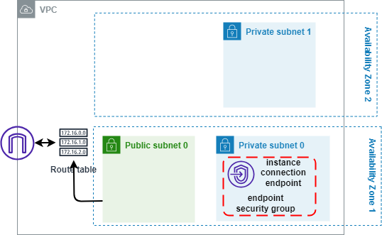

<!-- BEGIN_TF_DOCS -->
# IT Syndicate Boot Camp
## The base infrastructure to use in further labs
### Implement Infrastructure using Terraform
To implement a basic AWS infrastrucutre with Terraform. There should be possibility to use the infrastructure in further labs. The infrastructure should include:
- VPC
- Private and Public subnets in two different availability zones
- NATs
- A bastion host with a public IP

### Solution
The infrastructure includes a VPC with public and private subnets in the each of two availability zones. The bastion host placed in one of the public subnets.
#### Infrastructure diagram


#### Bastion host security group


#### Using Terraform remote state
The infrastructure accessable with Terraform remote state:
```hcl
data "terraform_remote_state" "base" {
  backend = "s3"
  config = {
    bucket  = "its-base-00"
    key     = "terraform.tfstate"
    region  = "us-east-1"
    encrypt = true
  }
}
```
### Reference
#### Outputs

| Name | Description |
|------|-------------|
| <a name="output_bastion_public_ip"></a> [bastion\_public\_ip](#output\_bastion\_public\_ip) | Bastion node publick IP address |
| <a name="output_bastion_security_group"></a> [bastion\_security\_group](#output\_bastion\_security\_group) | ID of the bastion security group |
| <a name="output_ec2_instance"></a> [ec2\_instance](#output\_ec2\_instance) | Main params of ec2 instance and the key pair |
| <a name="output_private_subnets"></a> [private\_subnets](#output\_private\_subnets) | List of private subnets IDs |
| <a name="output_public_subnets"></a> [public\_subnets](#output\_public\_subnets) | List of public subnets IDs |
| <a name="output_vpc_id"></a> [vpc\_id](#output\_vpc\_id) | The Sandbox VPC id |
#### Inputs

| Name | Description | Type | Default | Required |
|------|-------------|------|---------|:--------:|
| <a name="input_azs"></a> [azs](#input\_azs) | AWS availability zones | `list(string)` | <pre>[<br>  "us-east-1a",<br>  "us-east-1b"<br>]</pre> | no |
| <a name="input_bastion_pub_key"></a> [bastion\_pub\_key](#input\_bastion\_pub\_key) | SSH publick key for access to bastion host | `string` | `"ssh-ed25519 AAAAC3NzaC1lZDI1NTE5AAAAIDGOVO/Cag0QuYYm5ThB+zehSFbskFjLS1T34y/TxtJ9 bastion"` | no |
| <a name="input_ec2_ami_id"></a> [ec2\_ami\_id](#input\_ec2\_ami\_id) | AWS AMI id for EC2 instances | `string` | `"ami-0e62914c1cb94a559"` | no |
| <a name="input_ec2_type"></a> [ec2\_type](#input\_ec2\_type) | AWS EC2 instance type | `string` | `"t2.micro"` | no |
| <a name="input_env_name"></a> [env\_name](#input\_env\_name) | Environment tag | `string` | `"ITS-base"` | no |
| <a name="input_private_subnet_num"></a> [private\_subnet\_num](#input\_private\_subnet\_num) | Number of private subnets in each VPC | `number` | `2` | no |
| <a name="input_public_subnet_num"></a> [public\_subnet\_num](#input\_public\_subnet\_num) | Number of public subnets in each VPC | `number` | `2` | no |
| <a name="input_region"></a> [region](#input\_region) | AWS region for all recources and providers | `string` | `"us-east-1"` | no |
| <a name="input_vpc_cidr_prefix"></a> [vpc\_cidr\_prefix](#input\_vpc\_cidr\_prefix) | VPC CIDR base for calculating real VPC CIDRs | `string` | `"10.0.0.0/12"` | no |
| <a name="input_vpc_name"></a> [vpc\_name](#input\_vpc\_name) | VPC name tag | `string` | `"sandbox"` | no |
| <a name="input_vpc_num"></a> [vpc\_num](#input\_vpc\_num) | Number of VPCs | `number` | `1` | no |
#### Resources

| Name | Type |
|------|------|
| [aws_eip.bastion](https://registry.terraform.io/providers/hashicorp/aws/latest/docs/resources/eip) | resource |
| [aws_instance.bastion](https://registry.terraform.io/providers/hashicorp/aws/latest/docs/resources/instance) | resource |
| [aws_key_pair.bastion](https://registry.terraform.io/providers/hashicorp/aws/latest/docs/resources/key_pair) | resource |
#### Requirements

| Name | Version |
|------|---------|
| <a name="requirement_terraform"></a> [terraform](#requirement\_terraform) | >= 1.0 |
| <a name="requirement_aws"></a> [aws](#requirement\_aws) | >= 5.0 |
#### Providers

| Name | Version |
|------|---------|
| <a name="provider_aws"></a> [aws](#provider\_aws) | 5.17.0 |
<!-- END_TF_DOCS -->
