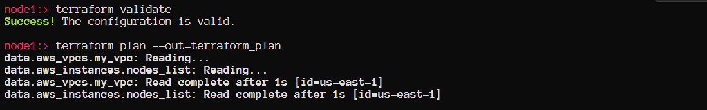
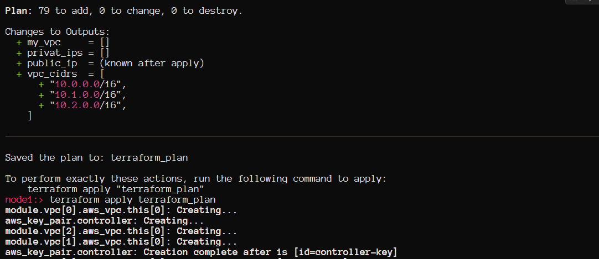
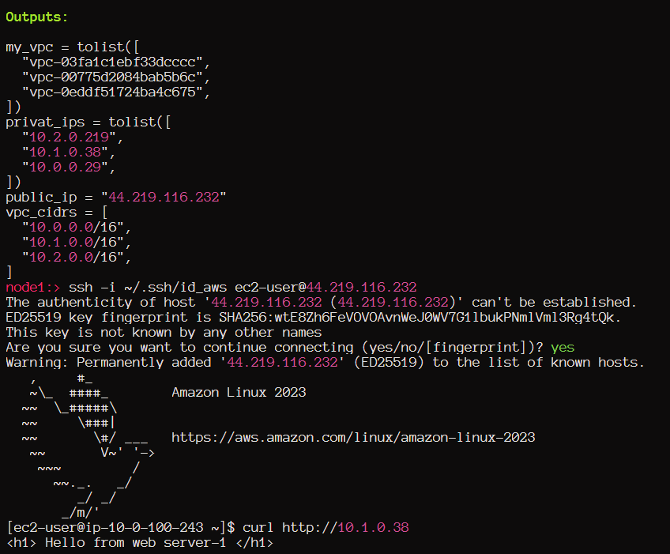
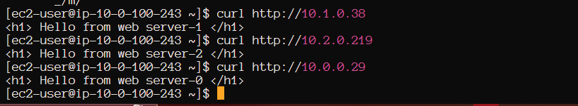
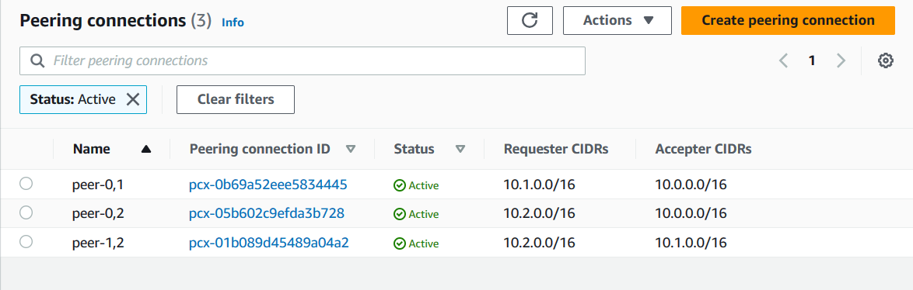
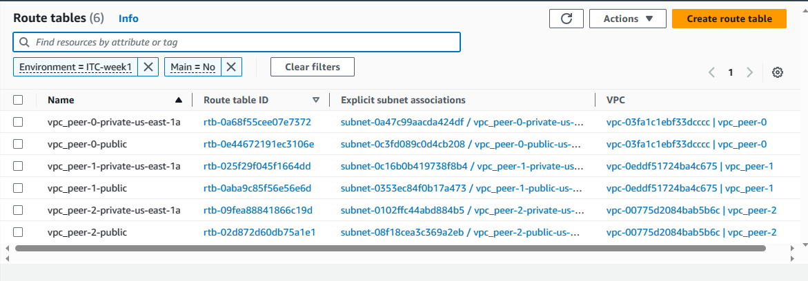
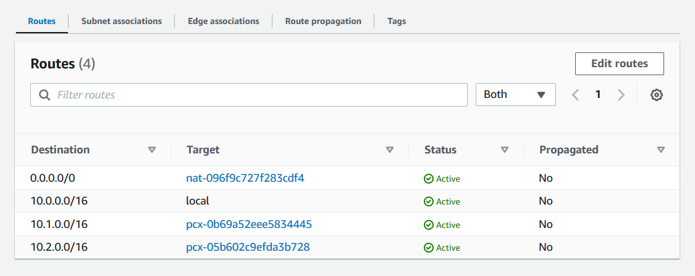
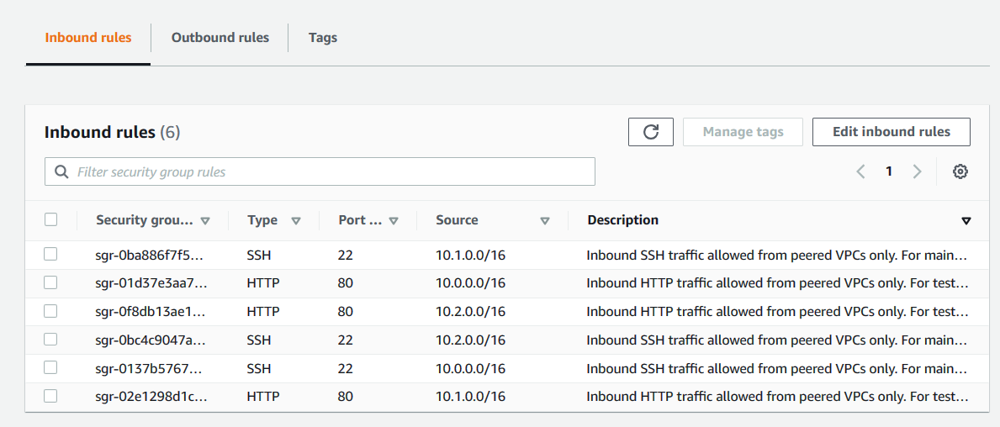
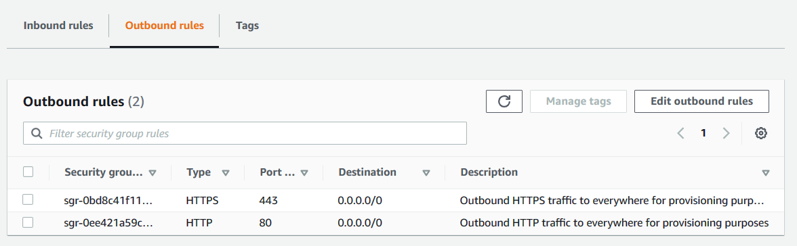

<!-- BEGIN_TF_DOCS -->
# IT Syndicate Boot Camp
## Week 1. Task 3
### Network Configuration and Web Server Deployment on AWS
As a newly onboarded DevOps engineer at our tech company, we've received a request from our client that requires careful attention. They need to set up one EC2 instance in each of the three different VPCs. The twist is that these instances need to communicate with each other, necessitating a VPC Peering setup. In addition, the client wants a web server  Nginx installed on these instances via the user-data feature. Use Terraform.
- Task 1: Set up one EC2 instance in each of the three different VPCs.
- Task 2: Configure VPC Peering between these VPCs so that the instances can communicate with each other. Be sure to verify and test this communication.
- Task 3: Using the user-data feature of EC2 instances, install a web server Nginx on each instance. Configure it to serve a simple HTML page on port 80.

*Hint: Be mindful of security configurations. Ensure that the security groups and network ACLs allow the necessary traffic for your setup.*
### Solution
This solution expands the task by allowing you to create any number of VPCs and create peering connections between these **VPC**s according to the “each to each” scheme.

#### VPCs
The specified number of **VPC**s is configured in the [vpc module](https://registry.terraform.io/modules/terraform-aws-modules/vpc/aws/latest). Despite on the solution is able to create any valid number of VPCs with specified numbers of private and public subnets, only one CIDR prefix is specified. The rest of CIDRs is calculated in the locals section:
```hcl
locals {
  # map of VPC CIDR blocks with private and bublic subnets CIDRs:
  # {vpc_cidr: 10.x.0.0/16
  # private_subnet_cidrs: 10.x.y.0/24
  # public_subnet_cidrs: 10.x.10y.0/24}
  cidrs = [for vcidr in [for x in range(var.vpc_num) : cidrsubnet(var.vpc_cidr_prefix, 4, x)] : {
    vpc_cidr             = vcidr
    private_subnet_cidrs = [for y in range(var.private_subnet_num) : cidrsubnet(vcidr, 8, y)]
    public_subnet_cidrs  = [for y in range(var.public_subnet_num) : cidrsubnet(vcidr, 8, 100 + y)]
  }]
}
```
The whole code dedicated to the VPCs peering is in the file [vpc.tf](vpc.tf)

#### Peering connections
Peering connections between all **VPC**s are then configured using the for_each meta argument. As a parameter for the meta-argument for_each, a special string array is used containing pairs of indexes created by the module, **VPC** - `["0.1", "0.2", "0.3",...,"0,n", ..., "n-1, n"]`. The array is created in the `locals` section and contains all possible combinations of pairs of indexes of another array, which was created by the vpc module. For each **VPC** pair, a resource `aws_vpc_peering_connection` is created where the indexes from each element of the pairs array are used to obtain the **VPC** IDs generated by the *vpc module*.
Routes for the routing tables of each of the subnets in each **VPC** are generated in a similar way. The string *("x,y")* containing the **VPC** index pair is also the key in the peering connection resource set. The CIDR of one of the **VPC**s of the peering pair is used as the destination of each route, and the peering connection itself is used as the gateway. This route is added to the routing table associated with a subnet belonging to another VPC from the same peering pair.
The array of **VPC** pairs generated as following:
```hcl
locals {
  # List of inxes of VPCs which joint into peering pairs: ["0,1",...,"0,n",..., "n-1,n"]
  # The list contains pairs by the scheme "each to each"
  peering_pairs = flatten([for vpc1 in range(var.vpc_num) : [
    for vpc2 in range(vpc1 + 1, var.vpc_num, 1) :
    join(",", [vpc1, vpc2])
    ]
  ])
}
```

All peering connections are configured as following:
```hcl
resource "aws_vpc_peering_connection" "peering" {
  for_each    = toset(local.peering_pairs)
  peer_vpc_id = module.vpc[tonumber(split(",", each.value)[0])].vpc_id
  vpc_id      = module.vpc[tonumber(split(",", each.value)[1])].vpc_id
  auto_accept = true
  tags = {
    Name = "peer-${each.value}"
  }
}
```

A route is configured as following:
```hcl
resource "aws_route" "direct_privat" {
  for_each = toset(keys(aws_vpc_peering_connection.peering))

  route_table_id            = module.vpc[tonumber(split(",", each.value)[1])].private_route_table_ids[0]
  destination_cidr_block    = module.vpc[tonumber(split(",", each.value)[0])].vpc_cidr_block
  vpc_peering_connection_id = aws_vpc_peering_connection.peering[each.value].id
}
```
The whole code dedicated to the VPCs peering is in the file [peering.tf](peering.tf)
#### Tools
The code was checked with **tflint**, **tfsec** and **checkov**. The documentation was created with **terraform-docs**
### Reference
#### Requirements

| Name | Version |
|------|---------|
| <a name="requirement_terraform"></a> [terraform](#requirement\_terraform) | >= 1.0 |
| <a name="requirement_aws"></a> [aws](#requirement\_aws) | >= 5.0 |
#### Providers

| Name | Version |
|------|---------|
| <a name="provider_aws"></a> [aws](#provider\_aws) | 5.14.0 |
#### Inputs

| Name | Description | Type | Default | Required |
|------|-------------|------|---------|:--------:|
| <a name="input_azs"></a> [azs](#input\_azs) | AWS availability zones | `list(string)` | <pre>[<br>  "us-east-1a",<br>  "us-east-1b",<br>  "us-east-1c"<br>]</pre> | no |
| <a name="input_controller_pub_key"></a> [controller\_pub\_key](#input\_controller\_pub\_key) | SSH publick key for access to controller host | `string` | `""` | no |
| <a name="input_ec2_ami_id"></a> [ec2\_ami\_id](#input\_ec2\_ami\_id) | AWS AMI id for EC2 instances | `string` | `"ami-0e1c5be2aa956338b"` | no |
| <a name="input_ec2_type"></a> [ec2\_type](#input\_ec2\_type) | AWS EC2 instance type | `string` | `"t3.micro"` | no |
| <a name="input_env_name"></a> [env\_name](#input\_env\_name) | Environment tag | `string` | `"Unknown"` | no |
| <a name="input_http_port_from"></a> [http\_port\_from](#input\_http\_port\_from) | HTTP remote port number for security group | `number` | `80` | no |
| <a name="input_http_port_to"></a> [http\_port\_to](#input\_http\_port\_to) | HTTP local port number for security group | `number` | `80` | no |
| <a name="input_https_port_from"></a> [https\_port\_from](#input\_https\_port\_from) | HTTPS remote port number for security group | `number` | `443` | no |
| <a name="input_https_port_to"></a> [https\_port\_to](#input\_https\_port\_to) | HTTPS local port number for security group | `number` | `443` | no |
| <a name="input_private_subnet_num"></a> [private\_subnet\_num](#input\_private\_subnet\_num) | Number of private subnets in each VPC | `number` | `1` | no |
| <a name="input_public_subnet_num"></a> [public\_subnet\_num](#input\_public\_subnet\_num) | Number of public subnets in each VPC | `number` | `0` | no |
| <a name="input_region"></a> [region](#input\_region) | AWS region for all recources and providers | `string` | `"us-east-1"` | no |
| <a name="input_ssh_port_from"></a> [ssh\_port\_from](#input\_ssh\_port\_from) | SSH remote port number for security group | `number` | `22` | no |
| <a name="input_ssh_port_to"></a> [ssh\_port\_to](#input\_ssh\_port\_to) | SSH local port number for security group | `number` | `22` | no |
| <a name="input_vpc_cidr_prefix"></a> [vpc\_cidr\_prefix](#input\_vpc\_cidr\_prefix) | VPC CIDR base for calculating real VPC CIDRs | `string` | `"10.0.0.0/0"` | no |
| <a name="input_vpc_name"></a> [vpc\_name](#input\_vpc\_name) | VPC name tag | `string` | `"Noname"` | no |
| <a name="input_vpc_num"></a> [vpc\_num](#input\_vpc\_num) | Number of VPCs | `number` | `1` | no |
#### Outputs

| Name | Description |
|------|-------------|
| <a name="output_my_vpc"></a> [my\_vpc](#output\_my\_vpc) | List of VPC IDs |
| <a name="output_privat_ips"></a> [privat\_ips](#output\_privat\_ips) | List of EC2 instances private IPs |
| <a name="output_public_ip"></a> [public\_ip](#output\_public\_ip) | Control node publick IP address |
| <a name="output_vpc_cidrs"></a> [vpc\_cidrs](#output\_vpc\_cidrs) | List of VPC CIDRs |
#### Resources

| Name | Type |
|------|------|
| [aws_eip.controller](https://registry.terraform.io/providers/hashicorp/aws/latest/docs/resources/eip) | resource |
| [aws_instance.controller](https://registry.terraform.io/providers/hashicorp/aws/latest/docs/resources/instance) | resource |
| [aws_instance.web_server](https://registry.terraform.io/providers/hashicorp/aws/latest/docs/resources/instance) | resource |
| [aws_key_pair.controller](https://registry.terraform.io/providers/hashicorp/aws/latest/docs/resources/key_pair) | resource |
| [aws_route.backward_privat](https://registry.terraform.io/providers/hashicorp/aws/latest/docs/resources/route) | resource |
| [aws_route.backward_public](https://registry.terraform.io/providers/hashicorp/aws/latest/docs/resources/route) | resource |
| [aws_route.direct_privat](https://registry.terraform.io/providers/hashicorp/aws/latest/docs/resources/route) | resource |
| [aws_route.direct_public](https://registry.terraform.io/providers/hashicorp/aws/latest/docs/resources/route) | resource |
| [aws_security_group.controller_public_access](https://registry.terraform.io/providers/hashicorp/aws/latest/docs/resources/security_group) | resource |
| [aws_security_group_rule.http_egress](https://registry.terraform.io/providers/hashicorp/aws/latest/docs/resources/security_group_rule) | resource |
| [aws_security_group_rule.http_ingress](https://registry.terraform.io/providers/hashicorp/aws/latest/docs/resources/security_group_rule) | resource |
| [aws_security_group_rule.https_egress](https://registry.terraform.io/providers/hashicorp/aws/latest/docs/resources/security_group_rule) | resource |
| [aws_security_group_rule.ssh_ingress](https://registry.terraform.io/providers/hashicorp/aws/latest/docs/resources/security_group_rule) | resource |
| [aws_vpc_peering_connection.peering](https://registry.terraform.io/providers/hashicorp/aws/latest/docs/resources/vpc_peering_connection) | resource |
### Results
#### Terraform commands








#### AWS console






<!-- END_TF_DOCS -->