<!-- BEGIN_TF_DOCS -->
# IT Syndicate Boot Camp
## Week 2. Task 3
### Speed up application with CDN

The client is not satisfied with the application speed. He asked us to conduct a review and
provide suggestions for optimizing the application. Your tech lead researched and found that we need to set up a CDN to speed up the project.
You need:
- Connect AWS CloudFront before the load balancer
- Set up caching of dynamic and static content, except for /monitor and /tools locations
- Use the load testing tool to test your application through the CDN.
### Solution
The infrastructure scheme remains the same as in [Week2/task1 solution description](../task1/docs/solution.md).

#### CloudFront
I created a CloudFront Distribution with the network balancer as CloudFront Origin.

#### Screenshots
**CloudFront Distribution**
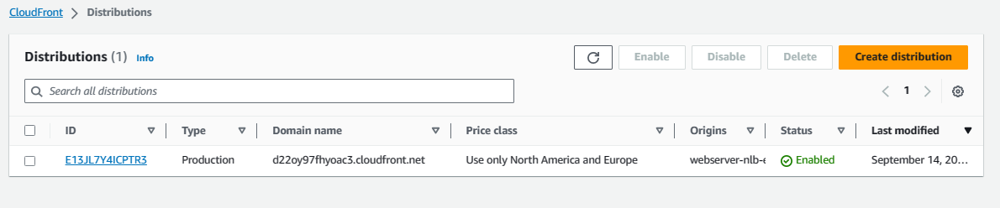
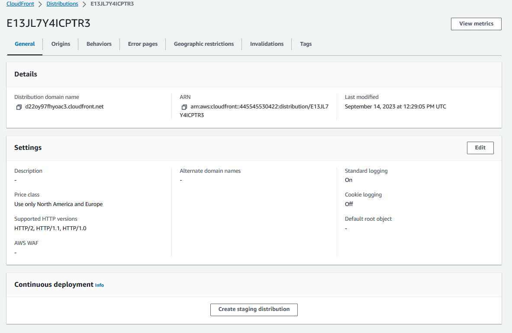

**CloudFront Origin**
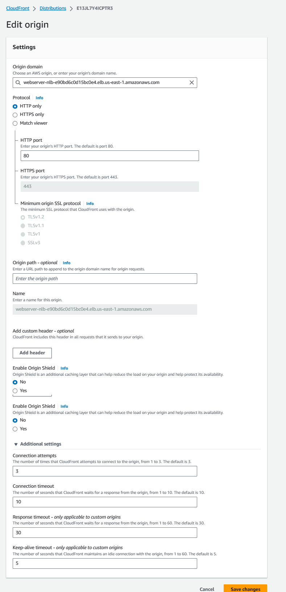
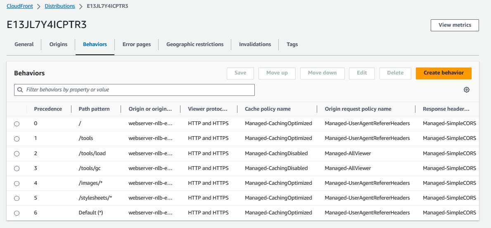

**CloudFront OAI**
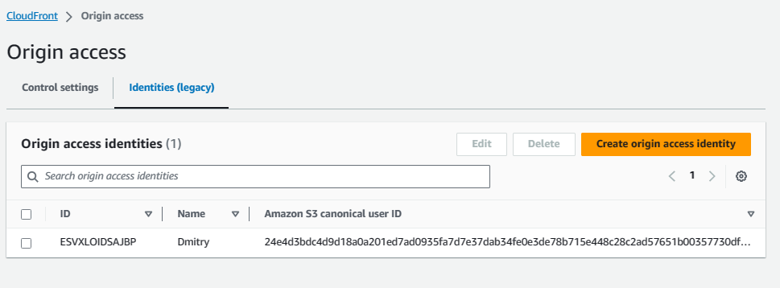

**CloudFront Distribution Logs**
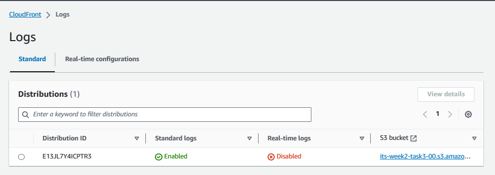
### Results
Test description, please, read here [Week2/task1](../README.md)

I ran two stress tests - the first one where all web pages static and dynamic were cached with CloudFront and the second test where only static pages, including images and css were chached. The stress test simulated a situation where the number of users is growing very quickly - 1 new user every second.

#### Test 1 - Stress test, all web resources cached
| Test conditions| |
|---------------|-----|
| maximum users | 500 |
| New user spawn taime | 1s |

Auto Scaling group:
| | instances |
|-|------------|
|Min.| 2 |
|Desired| 2 |
|Max.| 10 |

Auto Scaling policies:
| Alarm | In | OK |
|-------|----|----|
|CPU 20%|add 1 instance| remove 1 instance|
|CPU 30%|add 1 instance| remove 1 instance|
|CPU 40%|add 2 instances| remove 1 instance|
|CPU 50%|add 2 instances| remove 1 instance|

As you can see from the chart, CloudFront has been caching pages during early 10s of the test. When all pages have been cached the response time became minimal, it was less than 50 ms.
Non of computing resources of the autoscaling group were utilized!

**Load test Chart**
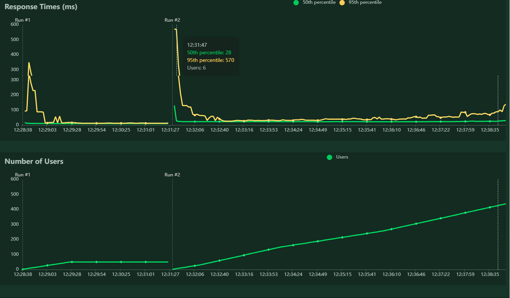
---

**CloudWatch Dashboard**
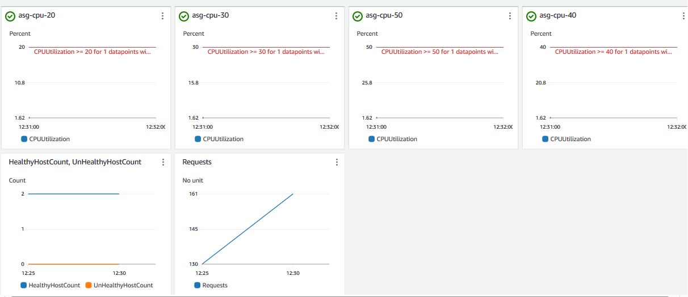
---

#### Test 2 - Stress test, static web resources cached only
Test conditions: the same as previous test.

Here we have a significant workload of the autoscaling group and responce time for dynamic web pages increased enormosly while the responce time for the static web resources remained minimal.

**Load test Chart**
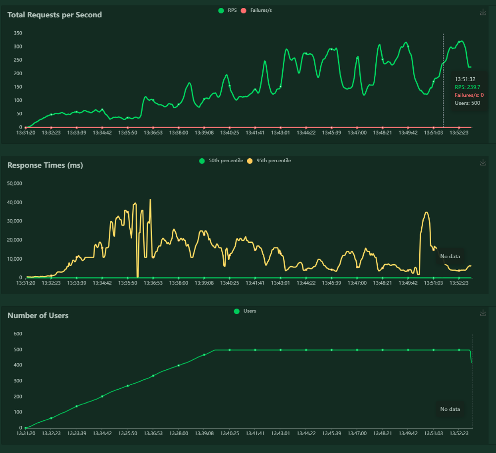
---

**CloudWatch Dashboard**
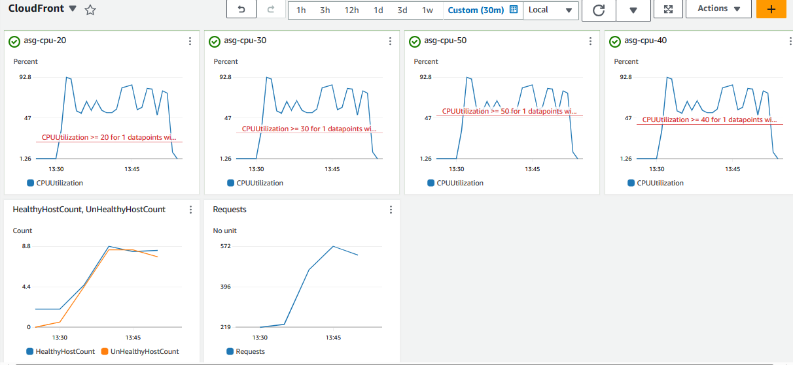
---

**CloudFront Statistics**
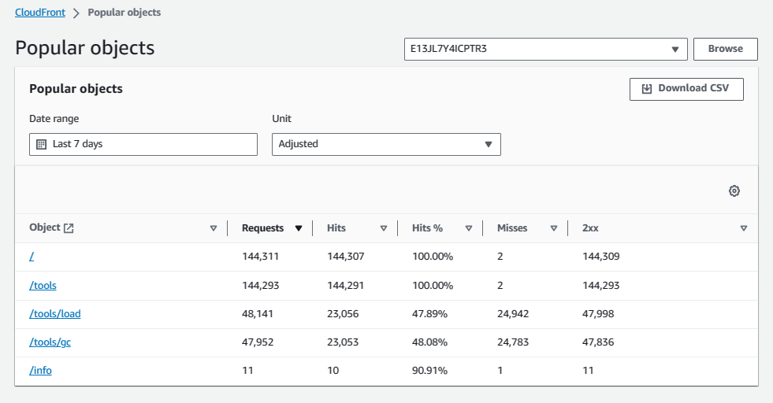
<!-- END_TF_DOCS -->
