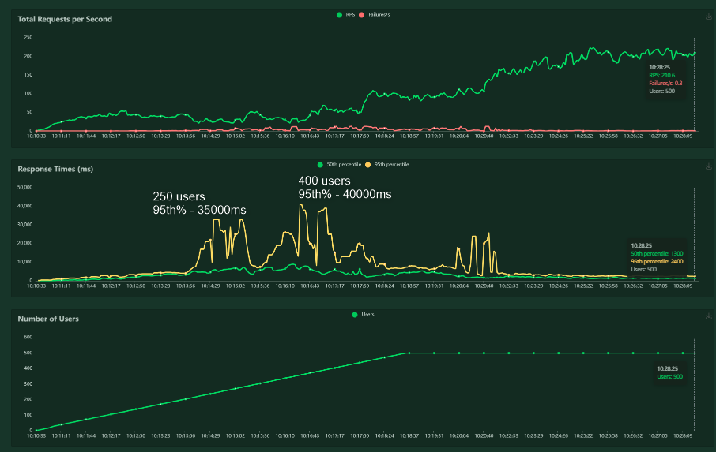
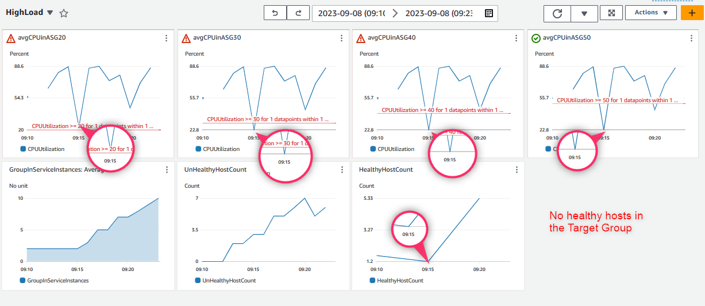
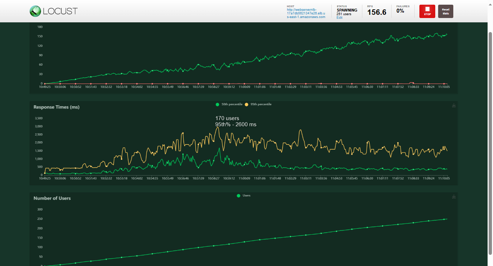
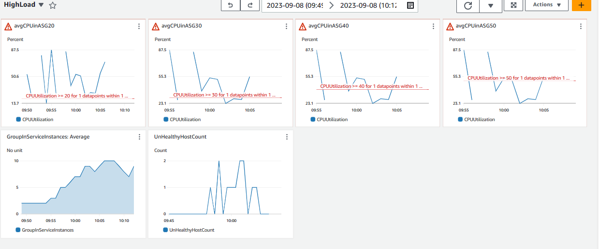

<!-- BEGIN_TF_DOCS -->
# IT Syndicate Boot Camp
## Week 2. Task 1
### Deploy and scale an application using Docker ans AWS

For this task, you're going to be part of the deployment team of a tech company. Our client is a
start-up that wants to deploy a simple web application and ensure its availability to
accommodate variable traffic volumes. You're asked to:
1. Use Docker to run a simple web application on AWS utilizing:
- EC2 Auto-scaling group
- ECS Fargate
2. Direct incoming traffic to the application through a load balancer.
3. Use a load testing tool to simulate high traffic load on the endpoint, triggering resource
scaling and observing the process.
4. In conclusion, prepare a report detailing the pros and cons of each deployment method in
terms of ease of setup, cost, and scalability.
### Solution
#### Deployment app container to EC2
In this solution, I deploy containers with the test application on EC2 instances in an autoscaling group. A network balancer is used to balance requests. I didn't use the application balancer because of the test application is a monolith and there is no way to effectively distribute the load along different routes. I decided that using an application balancer would not provide any benefit. The design also includes a bastion host for secure access to instances running containers.
Automatic scaling out/in of the group occurs in stages when four CloudWatch alarms are triggered - the average CPU utilization of the group reaches 20%, 30%, 40% and 50%.
Alarms are configured with a minimum response period - one threshold value per 1 minute. To do this, I had to create my own dynamic policies in the autoscaling group and also to enable detailed CloudWatch monitoring in the EC2 instance launch template.
Please see [the solution schema and console screenshots](docs/ec2_asg.md)
### Results
I ran two tests - one stress test and a load test. The stress test simulated a situation where the number of users is growing very quickly - 1 new user every second.

#### Test 1 - Stress test
| Test conditions| |
|---------------|-----|
| maximum users | 500 |
| New user spawn taime | 1s |

Auto Scaling group:
| | instances |
|-|------------|
|Min.| 2 |
|Desired| 2 |
|Max.| 10 |

Auto Scaling policies:
| Alarm | In | OK |
|-------|----|----|
|CPU 20%|add 1 instance| remove 1 instance|
|CPU 30%|add 1 instance| remove 1 instance|
|CPU 40%|add 2 instances| remove 1 instance|
|CPU 50%|add 2 instances| remove 1 instance|

The load test failed, as seen in the chart in range from 250 concurrent users up to 400 concurrent users, the response time was unacceptably high up to 40s.
Even though the response time dropped to normal when the maximum number of concurrent users reached 500, the auto scaling group was unable to add instances on time. As you can see on the CloudWatch dashboard screenshot, at some point there is not a single instance that meets the healthcheck conditions.

**Load test Chart**

---

**CloudWatch Dashboard**

---

#### Test 2 - Load test
The conditions of this test are much softer, new users appear 5 times slower - one new user every 5 seconds.
As you can see from the chart, the problematic range from the last test was passed with dignity - the response time was no more than 2.6s
| Test conditions| |
|---------------|-----|
| maximum users | 500 |
| New user spawn taime | 0.2s |

**Load test Chart**

---

**CloudWatch Dashboard**

---
<!-- END_TF_DOCS -->
