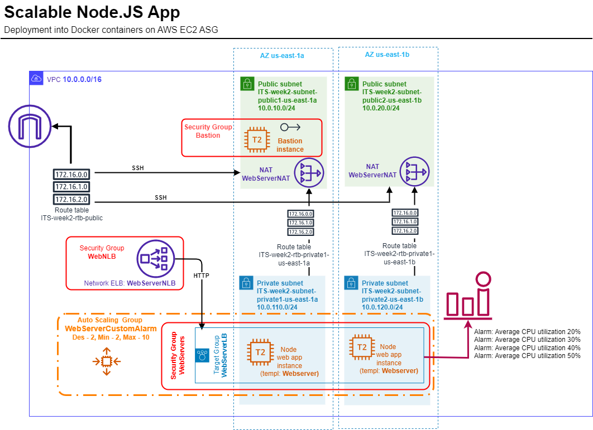
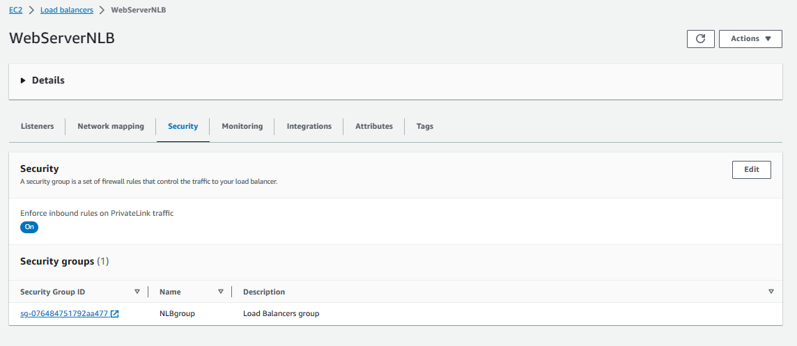

<!-- BEGIN_TF_DOCS -->
# IT Syndicate Boot Camp
## Week 2. Task 1
### Deploy and scale an application using Docker ans AWS

For this task, you're going to be part of the deployment team of a tech company. Our client is a
start-up that wants to deploy a simple web application and ensure its availability to
accommodate variable traffic volumes. You're asked to:
1. Use Docker to run a simple web application on AWS utilizing:
- EC2 Auto-scaling group
- ECS Fargate
2. Direct incoming traffic to the application through a load balancer.
3. Use a load testing tool to simulate high traffic load on the endpoint, triggering resource
scaling and observing the process.
4. In conclusion, prepare a report detailing the pros and cons of each deployment method in
terms of ease of setup, cost, and scalability.
### Solution
#### Deployment app container to EC2
In this solution, I deploy containers with the test application on EC2 instances in an autoscaling group. A network balancer is used to balance requests. I didn't use the application balancer because of the test application is a monolith and there is no way to effectively distribute the load along different routes. I decided that using an application balancer would not provide any benefit.
The design also includes a bastion host for secure access to instances running containers.
Automatic scaling out/in of the group occurs in stages when four CloudWatch alarms are triggered - the average CPU utilization of the group reaches 20%, 30%, 40% and 50%.
Alarms are configured with a minimum response period - one threshold value per 1 minute. To do this, I had to create my own dynamic policies in the autoscaling group and also to enable detailed CloudWatch monitoring in the EC2 instance launch template.
##### Schema

##### AWS console screenshots

### Results
#### Workload tests results
<!-- END_TF_DOCS -->