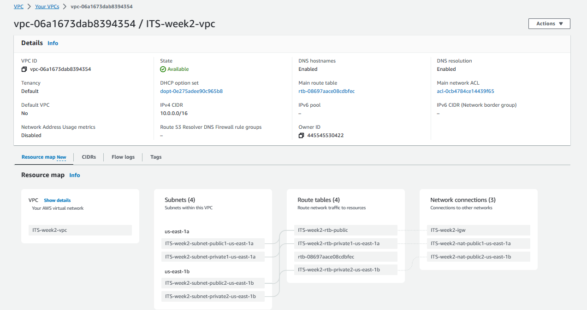
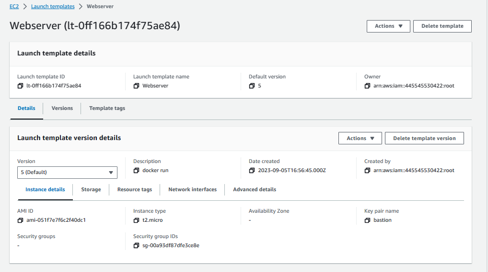
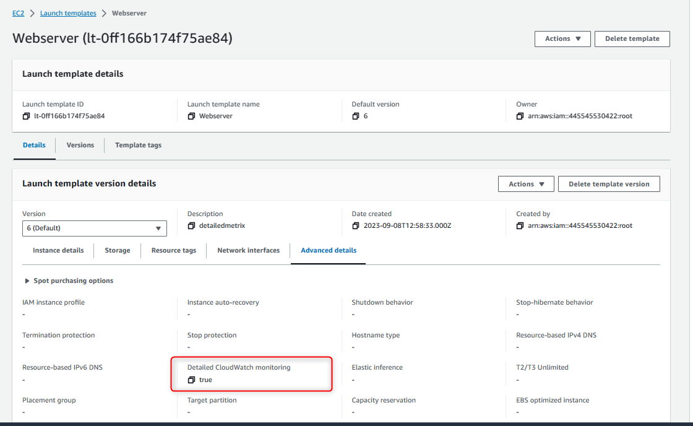
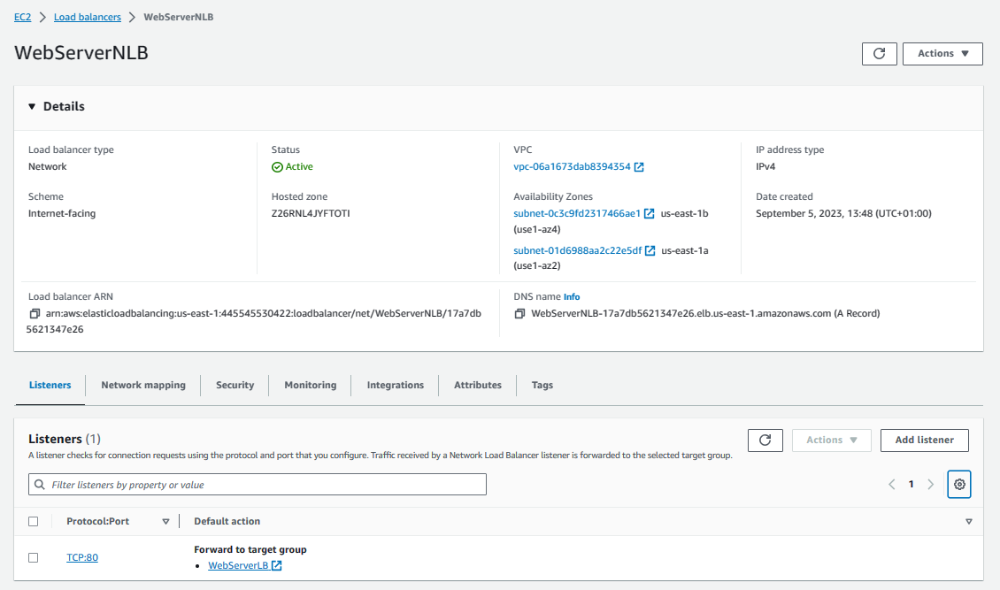
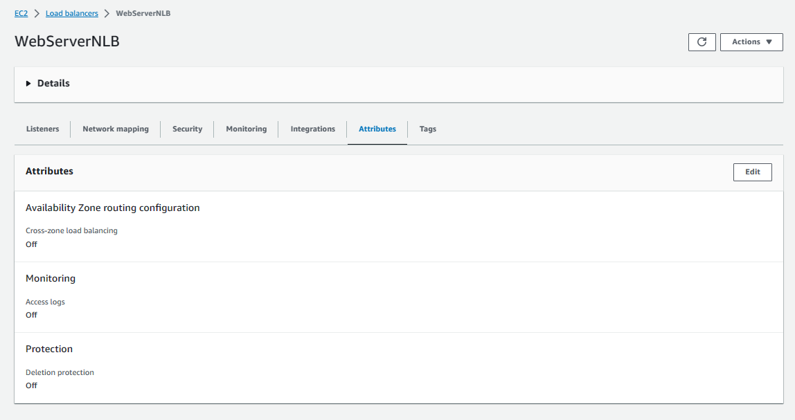
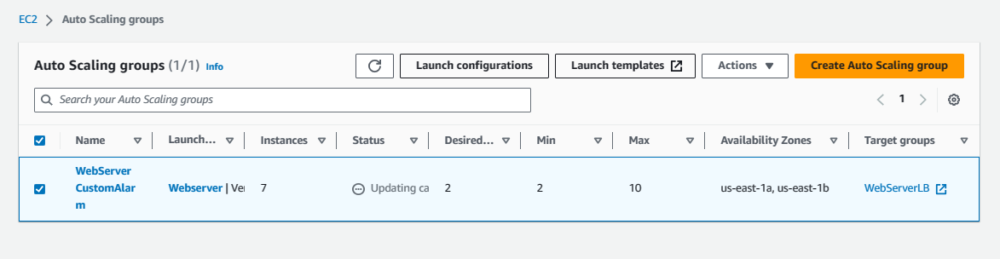

### Deployment Node.JS applicatin container to EC2 in Auto Scaling Group
#### Schema

#### AWS console screenshots
**VPC and subnets with routing**

---
**Launch template**

---
**Launch template with detailed CloudWatch monitoring ON**

---
**Launch template user data**

---
**Network Load Balancer and listener of port 80**

---
**Network Load Balancer networking**

---
**Network Load Balancer security groups**

---
**Network Load Balancer cross zone balancing off**

---
**Auto Scaling group**
*Desired instances: 2, Min: 2, Max: 10*

---
**Auto Scaling group - Scaling out simple scaling policies**

---
**Auto Scaling group - Scaling in simple scaling policies**

---
**CloudWatch alarms**

---
