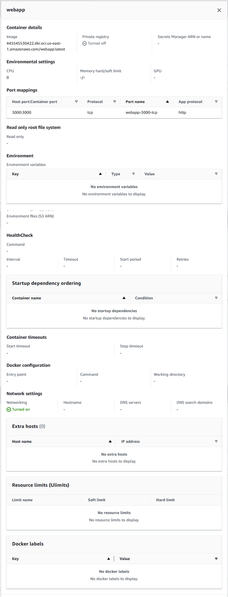
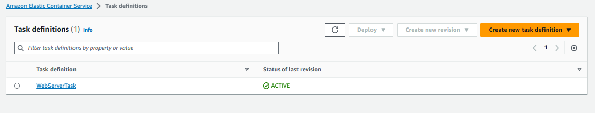
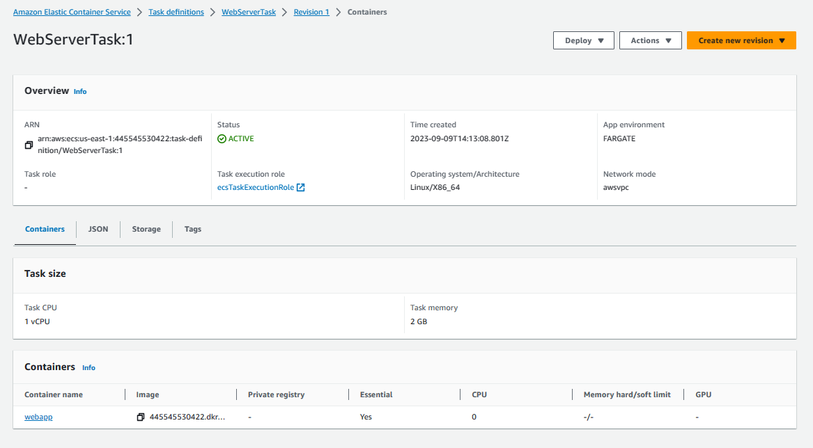
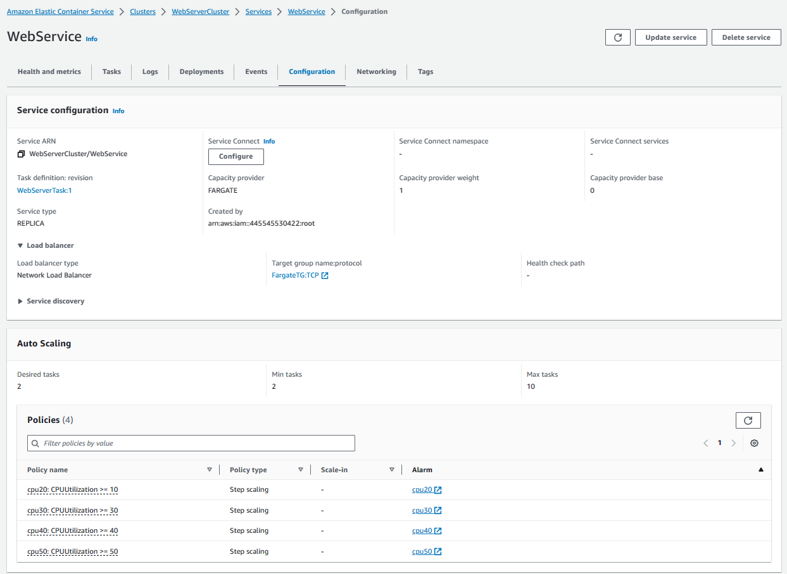
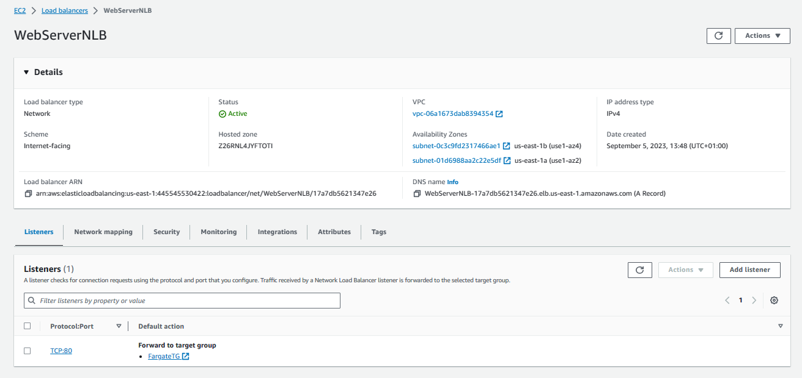
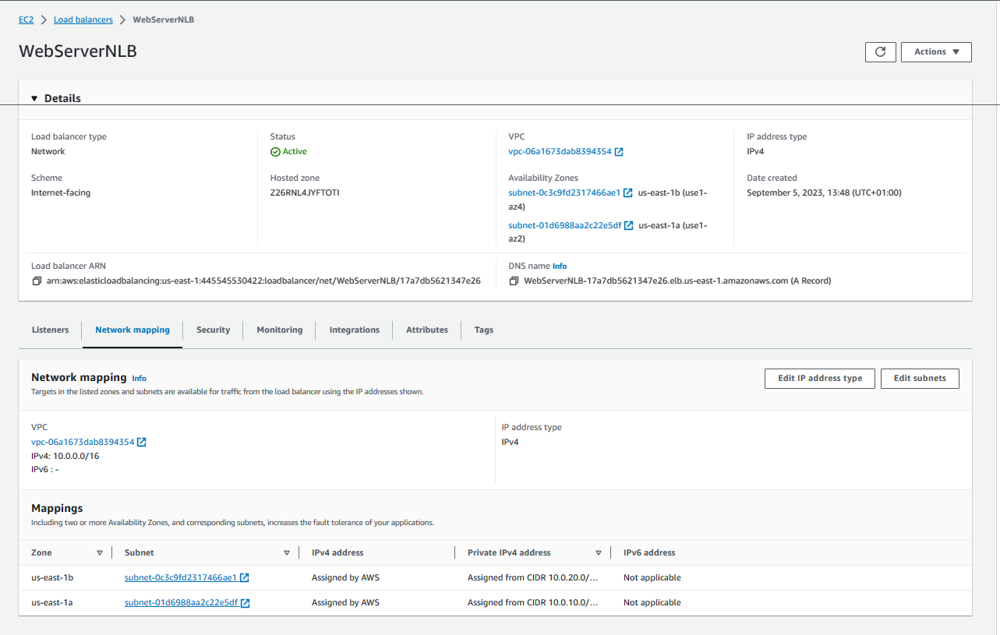
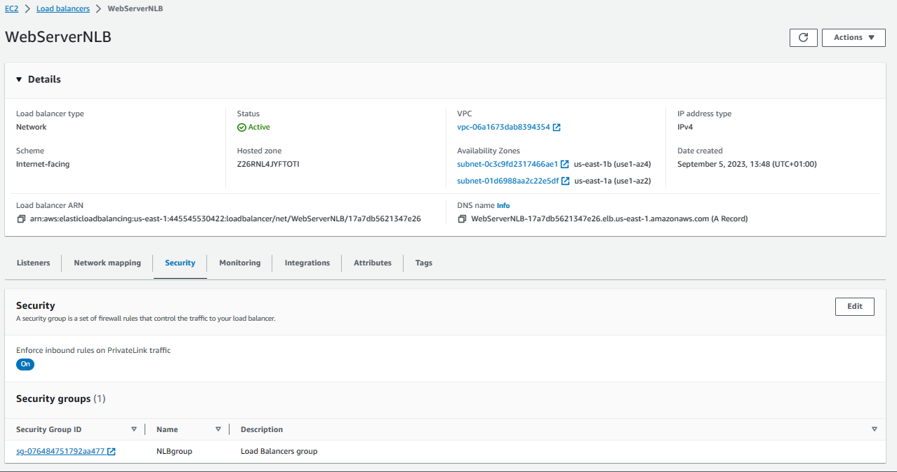
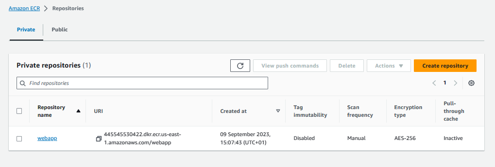
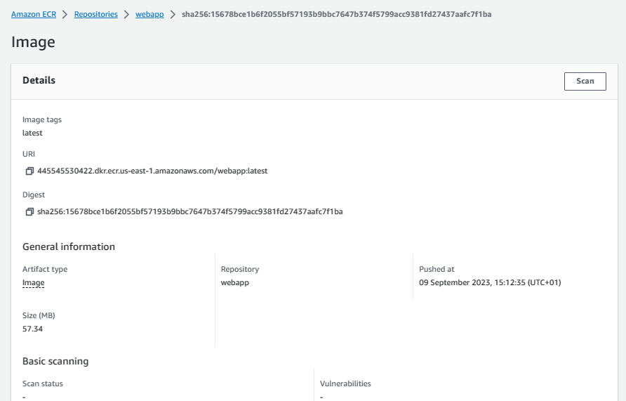

### Deployment Node.JS application container to ECS Fargate service

#### AWS console screenshots

**Container**

---

**Container**

---

**Task defenition**

---

**Task defenition**

---

**Webservice**

---

**Network Load Balancer**

---

**Network Load Balancer**

---

**Network Load Balancer**

---

**ECR**

---

**ECR**

---
