<!-- BEGIN_TF_DOCS -->
# IT Syndicate Boot Camp
## Week 3. Task 1
### Implement Infrastructure using Terraform
##### Scenario:
Imagine you're a DevOps engineer at a growing startup. The company has recently developed a
new application and wants to leverage AWS for hosting the application. They need to set up and
manage the infrastructure Your task involves:
 1. Using Terraform, describe the infrastructure for the application from the previous task
https://github.com/benc-uk/nodejs-demoapp
 2. Set up and configure an EC2 Auto Scaling group, where the application will be run using
Docker configured through EC2 user data. The infrastructure should include:
 - Network and security groups
 - EC2 Auto Scaling group (you can use this module for reference or implementation: erraform-aws-modules/autoscaling/aws)
 - Load balancer and target group

**Bonus Task**: For those who complete the task quickly, use Terraform to set up email notifications for scaling events using CloudWatch and SNS.
### Solution
This solution utilizes a range of terraform modules from A. Babenko:
 - [vpc](https://registry.terraform.io/modules/terraform-aws-modules/vpc/aws/latest)
 - [autoscaling](https://registry.terraform.io/modules/terraform-aws-modules/autoscaling/aws/latest)
 - [security-group](https://registry.terraform.io/modules/terraform-aws-modules/security-group/aws/latest)
 - [autoscaling](https://registry.terraform.io/modules/terraform-aws-modules/autoscaling/aws/latest)
 - [alb](https://registry.terraform.io/modules/terraform-aws-modules/alb/aws/latest)

The infrastructure scheme remains the same as in [Week2/task1 solution description](../../week2/task1/docs/solution.md).

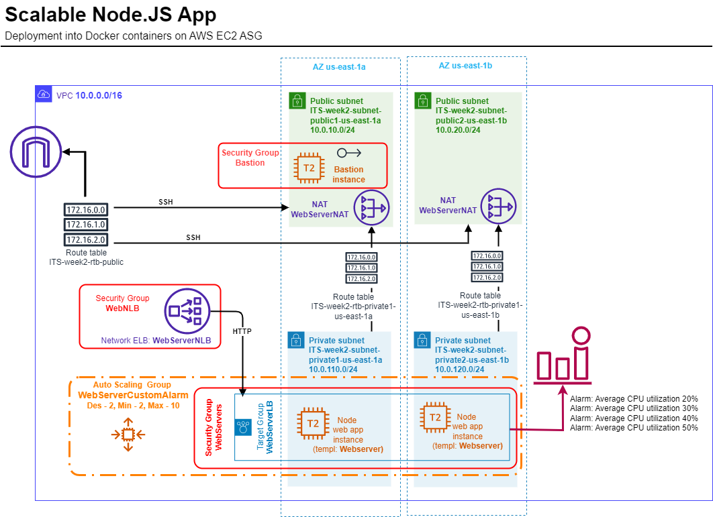
### Reference
#### Requirements

| Name | Version |
|------|---------|
|  [terraform](#requirement\_terraform) | >= 1.0 |
|  [aws](#requirement\_aws) | >= 5.0 |
#### Providers

| Name | Version |
|------|---------|
|  [aws](#provider\_aws) | 5.16.1 |
#### Inputs

| Name | Description | Type | Default | Required |
|------|-------------|------|---------|:--------:|
|  [asg\_desire](#input\_asg\_desire) | Desire number of EC2 instances in Autoscaling Group | `number` | `0` | no |
|  [asg\_max](#input\_asg\_max) | Maximal number of EC2 instances in Autoscaling Group | `number` | `0` | no |
|  [asg\_min](#input\_asg\_min) | Minimal number of EC2 instances in Autoscaling Group | `number` | `0` | no |
|  [asg\_name](#input\_asg\_name) | Autoscaling group name | `string` | `"my-asg"` | no |
|  [azs](#input\_azs) | AWS availability zones | `list(string)` | <pre>[   "us-east-1a",   "us-east-1b",   "us-east-1c" ]</pre> | no |
|  [bastion\_pub\_key](#input\_bastion\_pub\_key) | SSH publick key for access to bastion host | `string` | `""` | no |
|  [ec2\_ami\_id](#input\_ec2\_ami\_id) | AWS AMI id for EC2 instances | `string` | `"ami-0e1c5be2aa956338b"` | no |
|  [ec2\_type](#input\_ec2\_type) | AWS EC2 instance type | `string` | `"t3.micro"` | no |
|  [elb\_name](#input\_elb\_name) | Load Balancer name | `string` | `"elb"` | no |
|  [env\_name](#input\_env\_name) | Environment tag | `string` | `"Unknown"` | no |
|  [launch\_templ\_descr](#input\_launch\_templ\_descr) | Launch template description | `string` | `"Launch Template for an ASG"` | no |
|  [launch\_templ\_name](#input\_launch\_templ\_name) | Launch template Name | `string` | `"my-template"` | no |
|  [private\_subnet\_num](#input\_private\_subnet\_num) | Number of private subnets in each VPC | `number` | `1` | no |
|  [public\_subnet\_num](#input\_public\_subnet\_num) | Number of public subnets in each VPC | `number` | `0` | no |
|  [region](#input\_region) | AWS region for all recources and providers | `string` | `"us-east-1"` | no |
|  [vpc\_cidr\_prefix](#input\_vpc\_cidr\_prefix) | VPC CIDR base for calculating real VPC CIDRs | `string` | `"10.0.0.0/0"` | no |
|  [vpc\_name](#input\_vpc\_name) | VPC name tag | `string` | `"Noname"` | no |
|  [vpc\_num](#input\_vpc\_num) | Number of VPCs | `number` | `1` | no |
#### Outputs

| Name | Description |
|------|-------------|
|  [bastion\_public\_ip](#output\_bastion\_public\_ip) | Bastion node publick IP address |
|  [elb\_dns](#output\_elb\_dns) | DNS name of the Web service |
#### Resources

| Name | Type |
|------|------|
| [aws_cloudwatch_metric_alarm.cpu_20](https://registry.terraform.io/providers/hashicorp/aws/latest/docs/resources/cloudwatch_metric_alarm) | resource |
| [aws_cloudwatch_metric_alarm.cpu_30](https://registry.terraform.io/providers/hashicorp/aws/latest/docs/resources/cloudwatch_metric_alarm) | resource |
| [aws_cloudwatch_metric_alarm.cpu_40](https://registry.terraform.io/providers/hashicorp/aws/latest/docs/resources/cloudwatch_metric_alarm) | resource |
| [aws_cloudwatch_metric_alarm.cpu_50](https://registry.terraform.io/providers/hashicorp/aws/latest/docs/resources/cloudwatch_metric_alarm) | resource |
| [aws_eip.bastion](https://registry.terraform.io/providers/hashicorp/aws/latest/docs/resources/eip) | resource |
| [aws_instance.bastion](https://registry.terraform.io/providers/hashicorp/aws/latest/docs/resources/instance) | resource |
| [aws_key_pair.bastion](https://registry.terraform.io/providers/hashicorp/aws/latest/docs/resources/key_pair) | resource |
### Results
### Screenshots
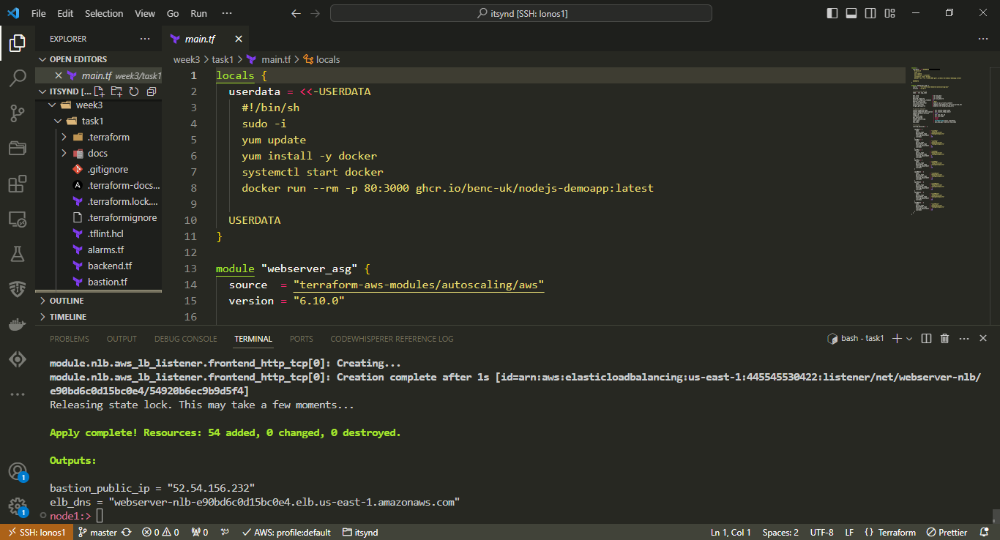
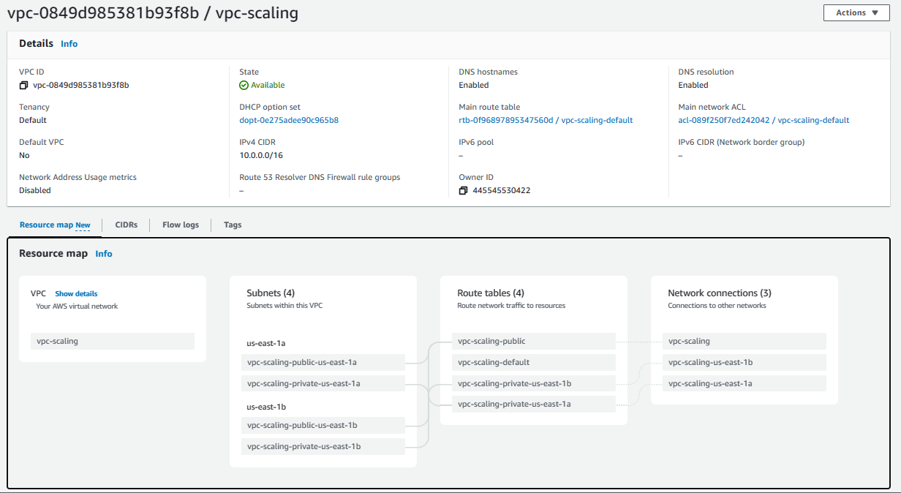
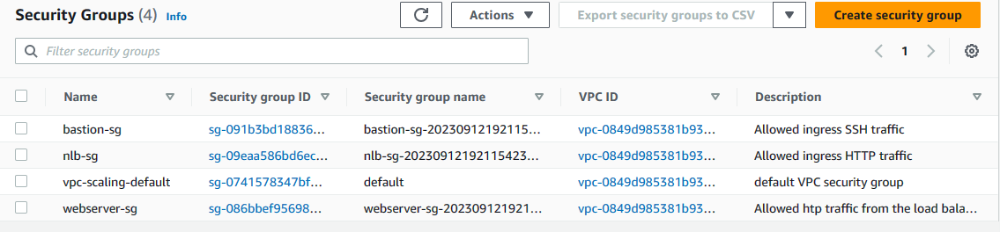
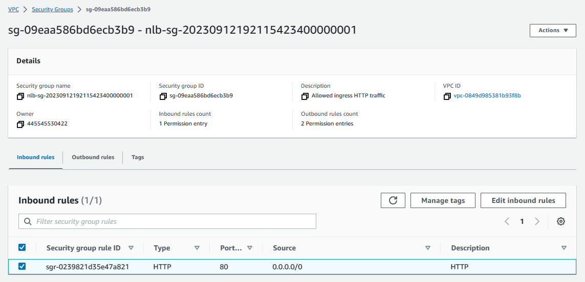
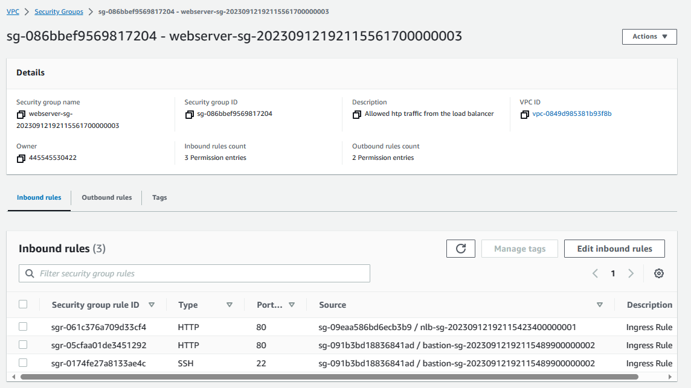
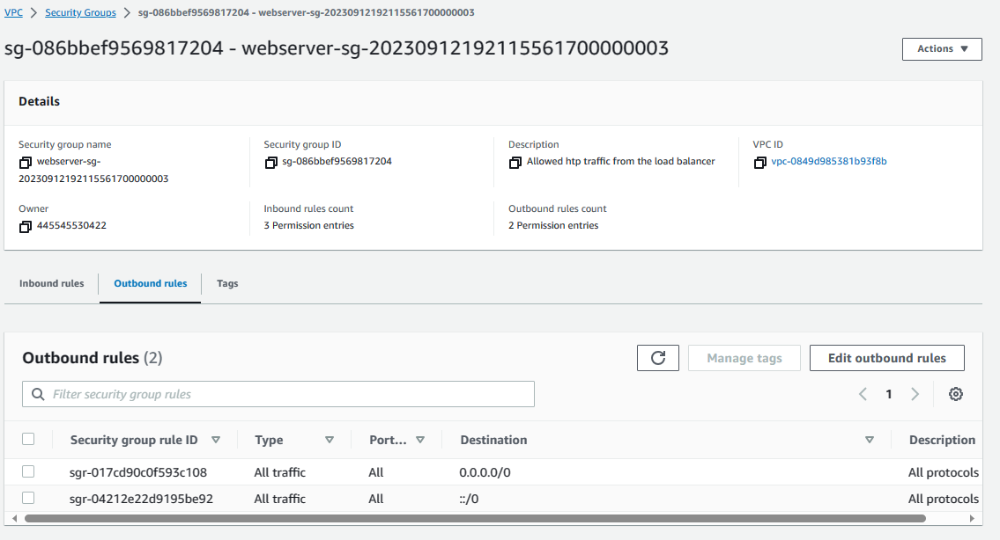
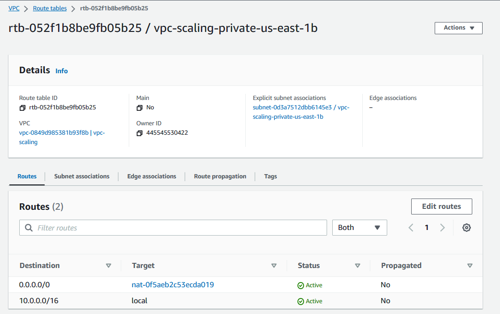
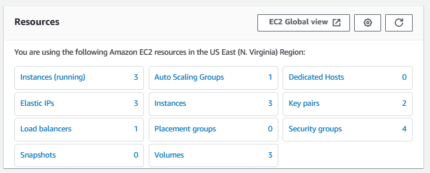
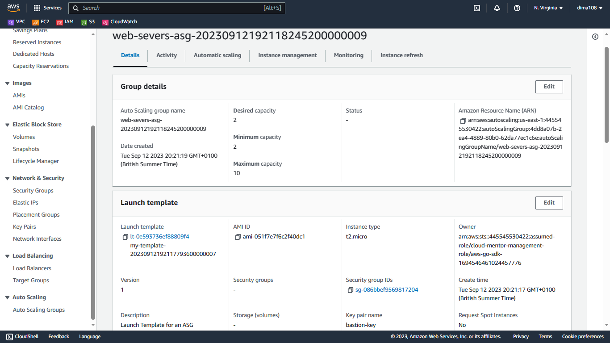

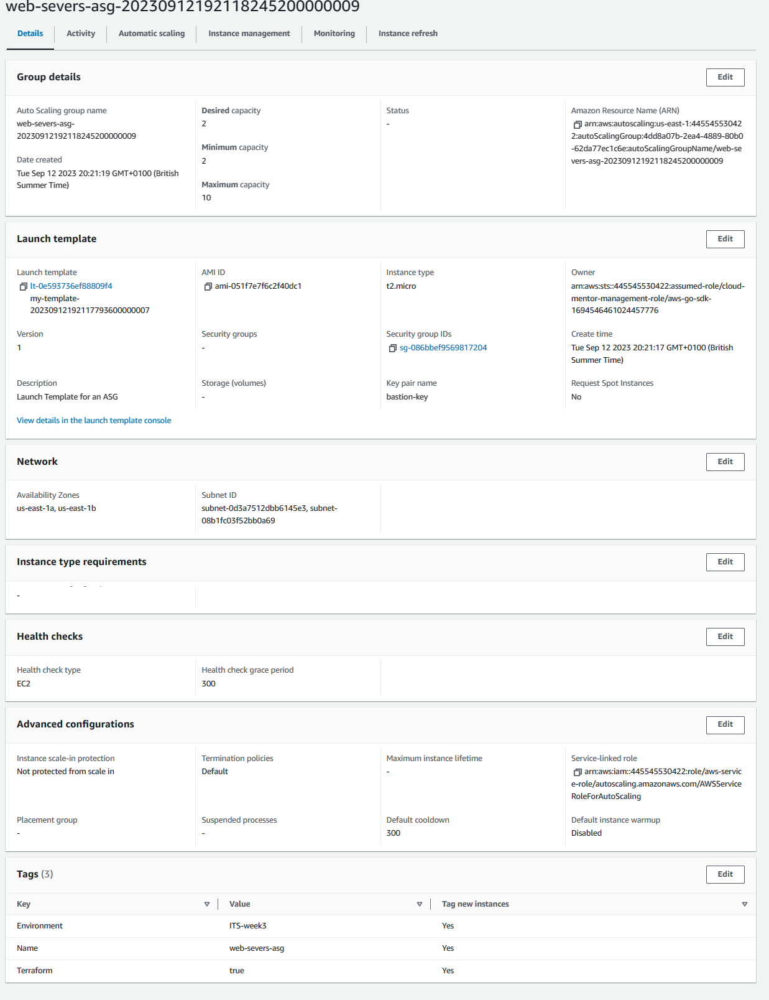
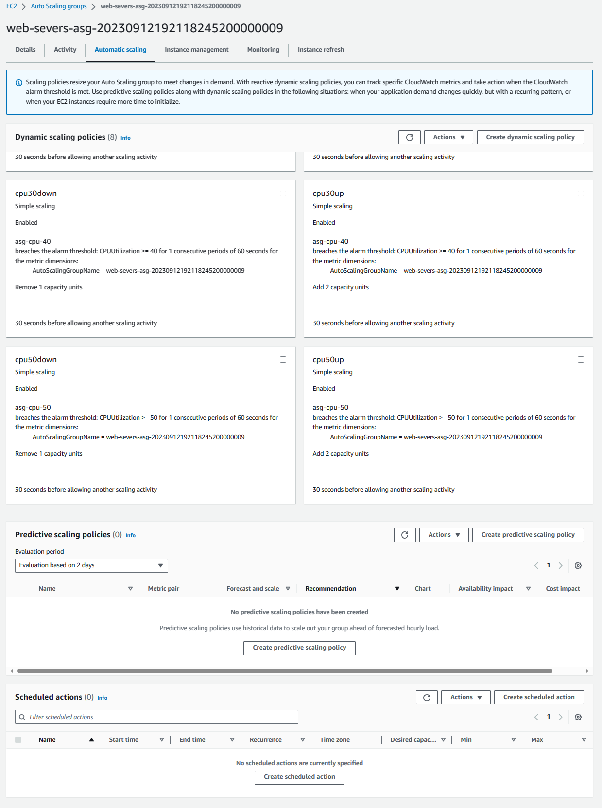
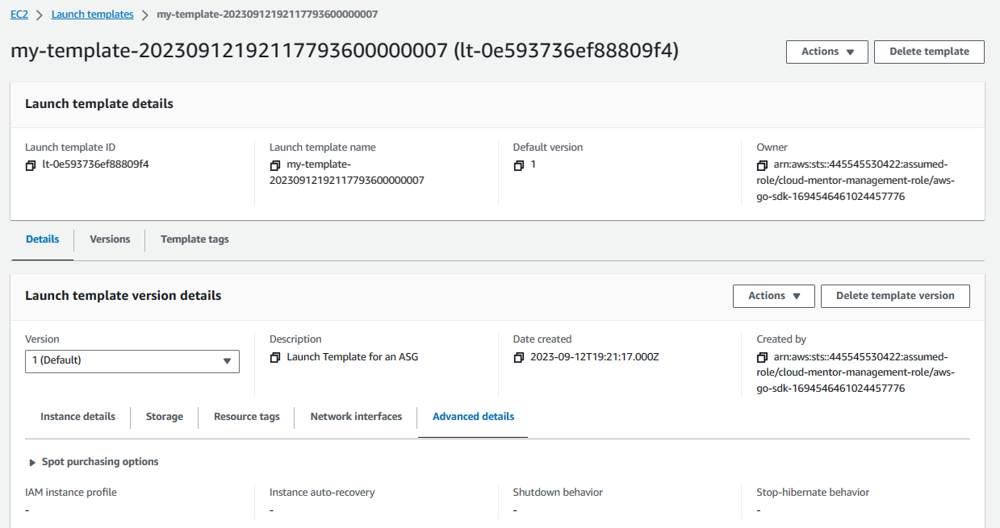
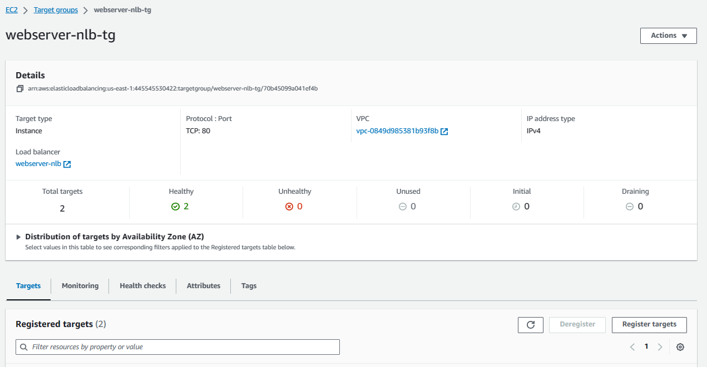
<!-- END_TF_DOCS -->