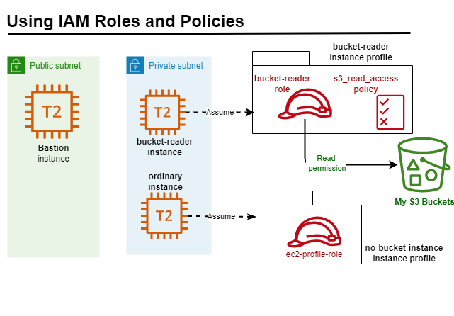
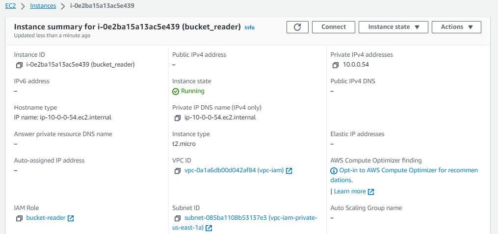
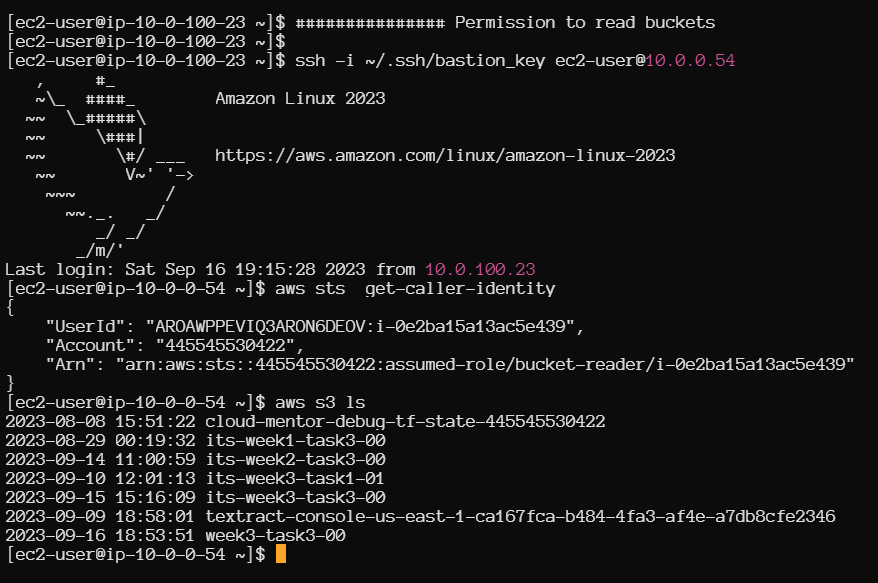

<!-- BEGIN_TF_DOCS -->
# IT Syndicate Boot Camp
## Week 3. Task 3
### Infrastructure Security
In this task, you will be implementing security measures to safeguard your infrastructure The
company is concerned about the possible vulnerabilities and wants to make sure that the
infrastructure is well protected Your responsibilities involve:
1. Use AWS Security Groups to implement virtual firewalls for your EC2 instances to control
inbound and outbound traffic.
2. Implement Identity and Access Management (IAM) policies to manage AWS service
permissions and safeguard access to resources.
3. *Use AWS Inspector to automate security assessment and find vulnerabilities or deviations
from best practices in your applications deployed on AWS.*
### Solution
#### Virtual Fierwall with AWS Security Groups
AWS Security Groups implements a statefull firewall. Here is a scheme of such fierwall built in the AWS infrastructure in the task [Week3/Task1](../task1/README.md). The infrastructure has three security groups:
- [bastion-sg](../task1/bastion.tf) (Allows inbound SSH traffic from the internet, outbound - all trafic to the internet)
- [nlb-sg](../task1/security_groups.tf) (Allows inbound HTTP traffic from the internet, outbound - all trafic to the internet)
- [webserver-sg](../task1/security_groups.tf) (Allows inbound HTTP traffic from the load balancer and bastion host. Outbound - all trafic to the internet).

#### IAM policies to manage AWS service permissions and safeguard access to resources
On top of the AWS infrastructure from the task [Week3/Task1](../task1/README.md) I built a small independant infrastructure to demonstrate using IAM policies and rolls to safeguard access to an AWS resource. This new infrastructure includes two EC2 instances with two different roles assumed on. One role  - `bucket-reader` grants read access to the all my S3 buckets while another one - `ec2-profile-role` does not. Here is the scheme:

The IAM rolls are declared [here](iam_roles.tf) and IAM policies are declared [here](iam_policies.tf). I created [AWS instance profiles](main.tf) to assume these roles to the instances.

Two AWS infrastructers integrated with a [remote state data source](remote_state.tf)

#### Screenshots
**EC2 instance with permission to read S3 buckets**

**EC2 instance with NO permission to read S3 buckets**

**Policy granting read access to S3 buckets**

**The role with no permition to read access to S3 buckets**

**Successful access to S3 buckets**

**Access denied**

### Reference
#### Requirements

| Name | Version |
|------|---------|
|  [terraform](#requirement\_terraform) | >= 1.0 |
|  [aws](#requirement\_aws) | >= 5.0 |
#### Providers

| Name | Version |
|------|---------|
|  [aws](#provider\_aws) | 5.17.0 |
|  [terraform](#provider\_terraform) | n/a |
#### Inputs

| Name | Description | Type | Default | Required |
|------|-------------|------|---------|:--------:|
|  [env\_name](#input\_env\_name) | Environment tag | `string` | `"Unknown"` | no |
|  [region](#input\_region) | AWS region for all recources and providers | `string` | `"us-east-1"` | no |
#### Outputs

No outputs.
#### Resources

| Name | Type |
|------|------|
| [aws_iam_instance_profile.bucket_reader](https://registry.terraform.io/providers/hashicorp/aws/latest/docs/resources/iam_instance_profile) | resource |
| [aws_iam_instance_profile.no_bucket_instance](https://registry.terraform.io/providers/hashicorp/aws/latest/docs/resources/iam_instance_profile) | resource |
| [aws_iam_policy.read_bucket](https://registry.terraform.io/providers/hashicorp/aws/latest/docs/resources/iam_policy) | resource |
| [aws_iam_role.bucket_reader](https://registry.terraform.io/providers/hashicorp/aws/latest/docs/resources/iam_role) | resource |
| [aws_iam_role.ec2_role](https://registry.terraform.io/providers/hashicorp/aws/latest/docs/resources/iam_role) | resource |
| [aws_iam_role_policy_attachment.s3_read_access2bucket_reader](https://registry.terraform.io/providers/hashicorp/aws/latest/docs/resources/iam_role_policy_attachment) | resource |
| [aws_instance.bucket_reader](https://registry.terraform.io/providers/hashicorp/aws/latest/docs/resources/instance) | resource |
| [aws_instance.ordinary_instance](https://registry.terraform.io/providers/hashicorp/aws/latest/docs/resources/instance) | resource |
<!-- END_TF_DOCS -->