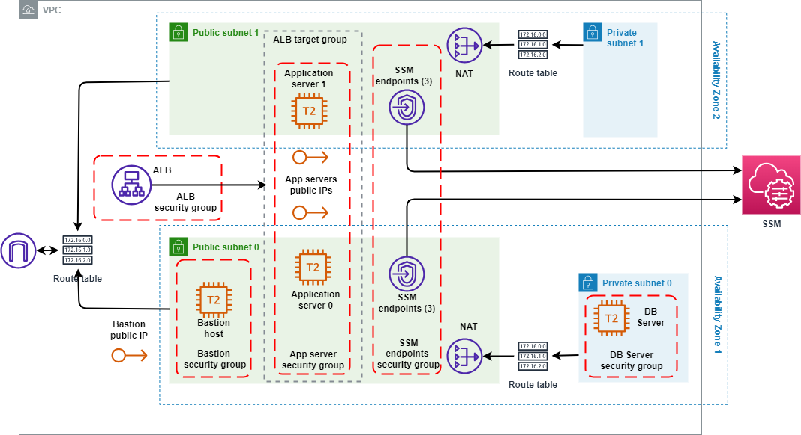
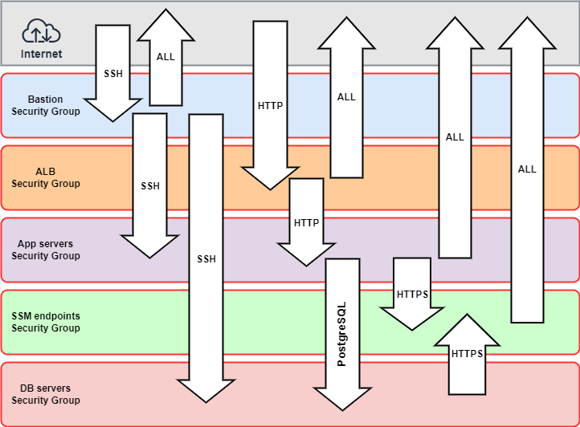
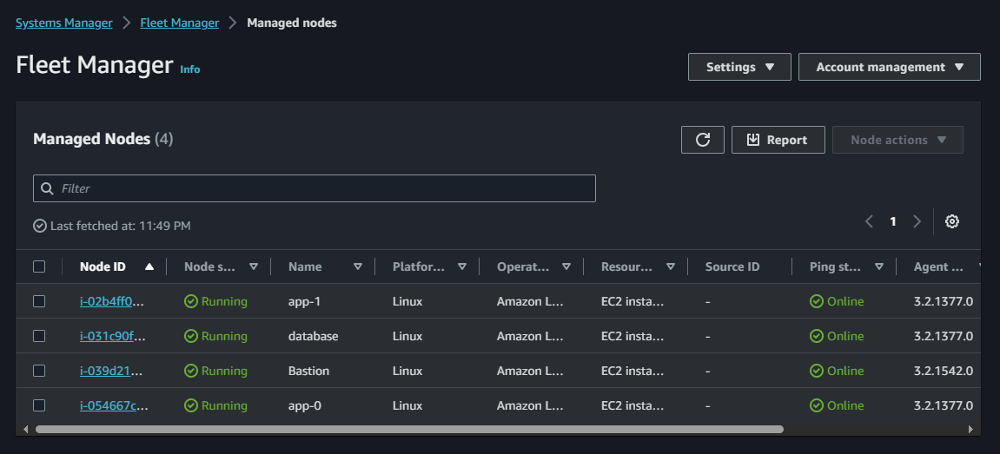

<!-- BEGIN_TF_DOCS -->
# Portfolio project
## Deploy and Configure Infrastructure Using Terraform and Ansible
### Task:
As a DevOps engineer tasked to deploy and set up servers for a new application
that requires a database. For this, we'll be deploying a [Django sample app from the
DigitalOcean team:](https://github.com/digitalocean/sample-django).

Your responsibilities will include:
1. Deploying the infrastructure using Terraform, which should consist of a VPC with public and private networks.
2. Creating three EC2 instances - two for the application in the public network and one for the database in the private network.
3. Configuring and installing SSM agent on instances using Terraform.

> Note: SSM is preinstalled on these AMIs:` Amazon Linux 2 Base / ECS-Optimized Base AMIs / 2023 (AL2023), Ubuntu Server 16.04, 18.04, and 20.04`.

4. Setting up a Load Balancer to distribute traffic among the application instances.
5. Producing an output file in inventory format for Ansible with Terraform.

For Ansible, you need to create three roles - two for setting up the infrastructure and one for deploying the application:
1. The infrastructure setup role should install Postgres on an instance and create a user and a database.
1. The role for application instances should be to install the necessary software to run the application and Nginx to proxy requests from the instance's port 80 to the Django application.
1. The deployment role should update the code from GitHub, update the configuration with the current DB credentials, and perform DB migrations.

Run these roles using the AWS EC2 System Manager. [Here, you can check how](https://aws.amazon.com/blogs/mt/running-ansible-playbooks-using-ec2-systems-manager-run-command-and-state-manager/).
## Solution
### AWS infrastructure
The requested infrastructure was built on top of the basic ifrastructure which already had been created. I utilized Terraform remote state to get access to the basic infrastructure.
The infrastructure includes AWS service endpoints which are neccesery for connecting instances without public IP addreses but placed in public subnets to the SSM service.
The following diagram represents the resulted infrastructure:


Fierwall diagram:


#### Setup SSM
In order to enable SSM for each instance I had to make the infrastructure complind to the following conditions:
 - The instances must be able to connect to SSM servers via HTTPS
 - The latest version of SSM agent should be installed and run on instances
 - A role with SSM policies should be assumed to every instanve
To achieve the first condition [AWS service endpoints](ssm.tf) which connect instances directly, avoiding the Internet, to the SSM services had been created. As well [sucurity group's rules](security_groups.tf) allowing HTTPS outbound traffic had been created.
The second condition was achieved with launching instances with AMI including the latest SMM agent. And the third condition was satisfied with [creating an instance profile](main.tf) containig a role with appropriate policies attached.
```hcl
# The role for instances which satisfies SSM conditions
resource "aws_iam_role_policy_attachment" "ssm_mamaged_core" {
  role       = aws_iam_role.ssm_managed.name
  policy_arn = "arn:aws:iam::aws:policy/AmazonSSMManagedInstanceCore"
}
resource "aws_iam_role_policy_attachment" "ssm_mamaged_default" {
  role       = aws_iam_role.ssm_managed.name
  policy_arn = "arn:aws:iam::aws:policy/AmazonSSMManagedEC2InstanceDefaultPolicy"
}
resource "aws_iam_role_policy_attachment" "ssm_mamaged_ec24ssm" {
  role       = aws_iam_role.ssm_managed.name
  policy_arn = "arn:aws:iam::aws:policy/service-role/AmazonEC2RoleforSSM"
}
```


### Ansible inventory
Ansible [inventory file](ansible/inventory) is generating automaticaly from the [Terraform configuration](inventory.tf) utilizing Terraform resource local_file and processing a [template file](inventory.tftpl).

Template file:
```
[app_servers]
%{ for app_ip in app_servers ~}
${app_ip}
%{ endfor ~}

[db_servers]
%{ for db_ip in db_servers ~}
${db_ip}
%{ endfor ~}

[all:vars]
ansible_ssh_user = ec2-user
```
Terraform configuration:
```hcl
resource "local_file" "ansible_inventory" {
  content = templatefile("${var.inventory_template}",
    {
      app_servers = aws_instance.app_servers[*].private_ip,
      db_servers  = [aws_instance.db.private_ip]
    }
  )

  filename = var.inventory_file
}
```
### Ansible Plays
**Connection to controlling nodes**
I did not use AWS SSM for running Ansible Playbooks as it was in the task because although this is a secure but slow and inconvinient way from debuging and development perspective.
I used more traditional way of ssh agent forwarding through the Bastion host.
As far I know there is a way combaining high security but still providing ability to work directly through ssh tunnel, [described here](https://medium.com/@shyam.rughani30/revolutionizing-access-no-more-bastion-hosts-with-aws-private-endpoint-3d7352a4dbe7). Unfortunately, I  had no chance to try this but definately it worths tryng in the future.

## Project highlights
1. Idempotency - The playbook does not have any task using shell or command modules. This ensures the playbook is 100% idempotent.
2. Transfering variables across plays and roles. In the playbook I have two plays working with different inventory groups. One play works with DB server and another with application servers. There was a problem how to pass the DB connection string generated on the database host to the application hosts. I used a "dummy host" as a variable storage accessable in all roles.
The [database setup task](ansible/roles/infra_setup/tasks/setup_db.yml) in the [infra_setup role](ansible/roles/infra_setup/tasks/main.yml) from [Install and Setup PostgreSQL play](ansible/playbook.yml):
```yaml
- name: Add variables to dummy host
  ansible.builtin.add_host:
    name: dummy
    db_url_: "postgres://{{ infra_setup_db_user }}:{{ infra_setup_db_user_passw }}@{{ infra_setup_db_host }}:{{ infra_setup_db_port }}/{{ infra_setup_db_name }}"
```
Passing the DB connection string to the [deploy role](ansible/roles/deploy/tasks/main.yml) in the [playbook](ansible/playbook.yml):
```yaml
deploy_app_db_url: "{{ hostvars['dummy']['db_url_'] }}"
```
3. DB password - I use the builtin filter to generate a randome but idempotetnt password:
```yaml
infra_setup_db_user_passw: "{{ lookup('ansible.builtin.password', '/dev/null', seed=inventory_hostname) }}"
```

### Reference
#### Requirements

| Name | Version |
|------|---------|
| <a name="requirement_terraform"></a> [terraform](#requirement\_terraform) | >= 1.0 |
| <a name="requirement_aws"></a> [aws](#requirement\_aws) | >= 5.0 |
#### Providers

| Name | Version |
|------|---------|
| <a name="provider_aws"></a> [aws](#provider\_aws) | 5.18.1 |
| <a name="provider_local"></a> [local](#provider\_local) | 2.4.0 |
| <a name="provider_terraform"></a> [terraform](#provider\_terraform) | n/a |
#### Inputs

| Name | Description | Type | Default | Required |
|------|-------------|------|---------|:--------:|
| <a name="input_azs"></a> [azs](#input\_azs) | AWS availability zones | `list(string)` | <pre>[<br>  "us-east-1a",<br>  "us-east-1b",<br>  "us-east-1c"<br>]</pre> | no |
| <a name="input_env_name"></a> [env\_name](#input\_env\_name) | Environment tag | `string` | `"ITS-week4-task1"` | no |
| <a name="input_inventory_file"></a> [inventory\_file](#input\_inventory\_file) | Path to Ansible inventory file | `string` | `"./ansible/inventory/hosts.ini"` | no |
| <a name="input_inventory_template"></a> [inventory\_template](#input\_inventory\_template) | Path to template to produce Ansible inventory file | `string` | `"inventory.tftpl"` | no |
| <a name="input_region"></a> [region](#input\_region) | AWS region for all recources and providers | `string` | `"us-east-1"` | no |
| <a name="input_ssh_config_file"></a> [ssh\_config\_file](#input\_ssh\_config\_file) | Path to ssh config file | `string` | `"ssh_config"` | no |
| <a name="input_ssh_config_template"></a> [ssh\_config\_template](#input\_ssh\_config\_template) | Path to template to produce ssh config file | `string` | `"ssh_config.tftpl"` | no |
#### Outputs

No outputs.
#### Resources

| Name | Type |
|------|------|
| [aws_eip.app_servers](https://registry.terraform.io/providers/hashicorp/aws/latest/docs/resources/eip) | resource |
| [aws_iam_instance_profile.ssm_enabled](https://registry.terraform.io/providers/hashicorp/aws/latest/docs/resources/iam_instance_profile) | resource |
| [aws_iam_role.ssm_managed](https://registry.terraform.io/providers/hashicorp/aws/latest/docs/resources/iam_role) | resource |
| [aws_iam_role_policy_attachment.ssm_mamaged_core](https://registry.terraform.io/providers/hashicorp/aws/latest/docs/resources/iam_role_policy_attachment) | resource |
| [aws_iam_role_policy_attachment.ssm_mamaged_default](https://registry.terraform.io/providers/hashicorp/aws/latest/docs/resources/iam_role_policy_attachment) | resource |
| [aws_iam_role_policy_attachment.ssm_mamaged_ec24ssm](https://registry.terraform.io/providers/hashicorp/aws/latest/docs/resources/iam_role_policy_attachment) | resource |
| [aws_instance.app_servers](https://registry.terraform.io/providers/hashicorp/aws/latest/docs/resources/instance) | resource |
| [aws_instance.db](https://registry.terraform.io/providers/hashicorp/aws/latest/docs/resources/instance) | resource |
| [aws_vpc_endpoint.ssm_enpoints](https://registry.terraform.io/providers/hashicorp/aws/latest/docs/resources/vpc_endpoint) | resource |
| [local_file.ansible_inventory](https://registry.terraform.io/providers/hashicorp/local/latest/docs/resources/file) | resource |
| [local_file.ssh_config](https://registry.terraform.io/providers/hashicorp/local/latest/docs/resources/file) | resource |
<!-- END_TF_DOCS -->
