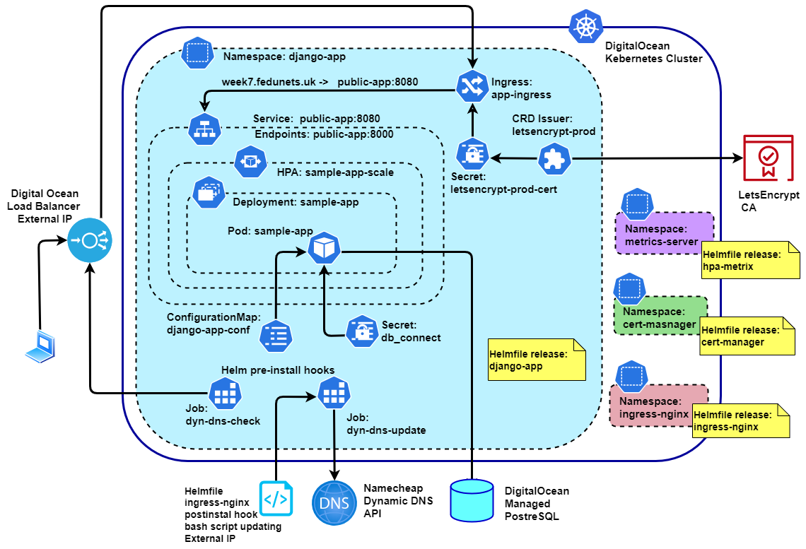
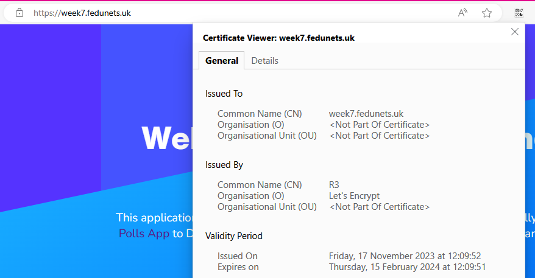
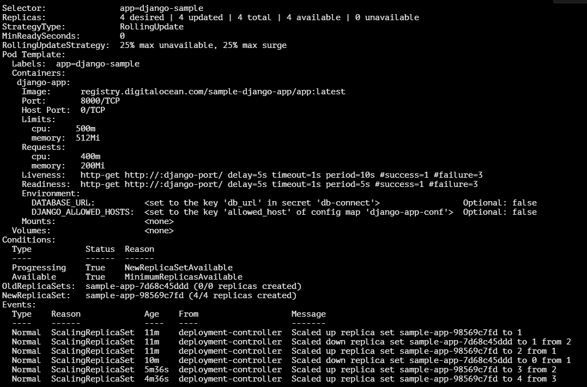
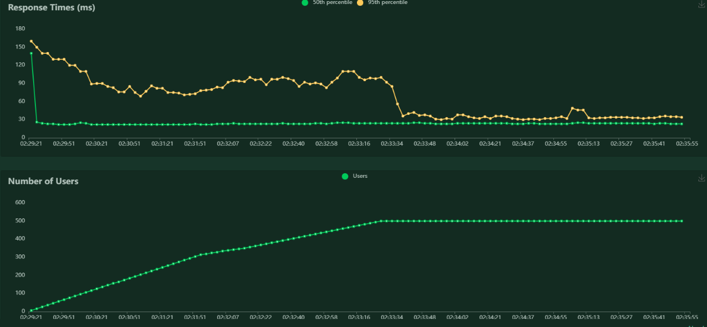

<!-- BEGIN_TF_DOCS -->
# Portfolio Project: Deploying a Django application in a managed Kubernetes cluster
## Scenario:
You are a part of a large IT company that wishes to use the power of Kubernetes for their container orchestration. The company has a new web application that needs to be deployed and managed in the cloud. 

It seamlessly combines dynamic and static content. The dynamic part of the application is built using the Django web framework which relies on a PostgreSQL database. To enhance security, the web application should be equipped with a TLS certificate from Let's Encrypt, ensuring that all data exchanged between the server and users is encrypted and secure.

Ensuring uninterrupted service during periods of high user demand is a critical concern for the business. 

The company wants to use Helm for deploying the application, as it is the most popular package manager for Kubernetes.

## Tasks:
1. Deploy a Kubernetes cluster in DigitalOcean cloud
1. Create a Helm chart for the application, which should include the following:
    1. ConfigMap for environment variables.
    1.  Secret for secret environment variables (such as database password). Secrets should be encrypted using any method available for Kubernetes (for instance, helm-secrets).
    1.  Deployment configuration that:
        - Runs two replicas of the application.
        - Operates on port 8080
        - Propagates ConfigMap and Secret to the container
        - Has readiness and liveness probes
    1. A Service of type ClusterIP
    1. An Ingress controller for Digital Ocean which will elevate the corresponding LB
    1. A CertManager, which will obtain a Let's Encrypt certificate
    1. A HorizontalPodAutoscaler, which will scale the replicas from 2 to 4 depending on the CPU or RAM usage at 80%
    1. Create and attach a persisent storrage to store the static web content.
2. Prepare a helmfile for deploying the environment
## Solution
### Cluster configuration:
I created DigitalOcean Kubernetes cluster with 3 worker nodes. Each node has:
```yaml
 allocatable:
    cpu: 1900m
    memory: 3110Mi
  capacity:
    cpu: "2"
    memory: 4009080Ki
```
### Helmfile releases
I implemented the following scheme including four [helmfile](digitalocean/helm/helmfile.yaml) releases: 
- `django-app` - sample django application
- `ingress-nginx` - Nginx ingress controller
- `cert-manager` - TLS Certificates manager
- `metrics-server` - HPA metrics server

The application release `django-app` depends on all the three others. 

### Cluster diagram


### Application Pod requirements and autoscaling
On the diagram [Deployment `sample-app`](digitalocean/helm/django-app/templates/deployment-app.yaml) deploys the sample django application from a Digital Ocean's private container repository. By default it runs 2 pod replicas. Each application pod requires by default:
```yaml
    resources:
      limits:
        cpu: 500m
        memory: 512Mi
      requests:
        cpu: 400m
        memory: 200Mi
```
For tis Deployment I defined [HorizontalPodAutoscaler (HPA)](digitalocean/helm/django-app/templates/autoscale-app.yaml). By default, it will scale up application Pod replicas from 2 to 6 when average CPU utilization reaches 50% or Memory utilization crosses 80% threshold:
```yaml
minReplicas: 2
maxReplicas: 6
 metrics:
    - type: Resource
      resource:
        name: cpu
        target:
          type: Utilization
          averageUtilization: 50
    - type: Resource
      resource:
        name: memory
        target:
          type: Utilization
          averageUtilization: 80
```
### Application settings and Secrets
All application settings are propagated to the application container from [Configmap `django-map-conf`](digitalocean/helm/django-app/templates/configmap-app-conf.yaml). 
The sample application requires an access to a PostgreSQl database. Here a managed Digital Ocean DB was provided. The database connection string including the db address and credentials stored in [Secret `db-connect`](digitalocean/helm/django-app/templates/secrets.yaml). The secret manifest was created by SOPS editor and  encrypted with a GPG key. 

### HTTP/HTTPS access
The access to the application is provided by Nginx ingress controller. The application [Service `public-app`](digitalocean/helm/django-app/templates/service-app.yaml) exposes port *:8080 while the application endpoints are accessable on port *:8000. By default the [Ingres `app-ingress`](digitalocean/helm/django-app/templates/ingress-app.yaml) routes all requests `week7.fedunets.uk/*` to the Service `public-app`:
```yaml
 rules:
  - host: week7.fedunets.uk
    http:    
      paths:
      - path: /
        pathType: Prefix
        backend:
          service:
            name: public-app
            port:
              number: 8080
```
#### TLS certificate
After installing the application tries to obtain a TLS certificate from Let's Encrypt CA. The [proces of issuing](digitalocean/helm/django-app/templates/issuer-cert.yaml) the certificate is managed by cert-manager release. The certificate stores in Secret `letsencrypt-prod-cert`.
By default, the Ingres requires a certificate for domain [week7.fedunets.uk](https://week7.fedunets.uk/):
```yaml
  tls:
    - hosts:
        - week7.fedunets.uk
      secretName: letsencrypt-prod-cert
```

### Pre-installation hooks
Since my application domain name hosted with Namechap.com DNS and Digital Ocean provides the external IP dynamicaly during installation of the ingress controller, I use Helmfile and Helm hooks to update the DNS record and check if the application is accessable by the defined FQDN.
#### Obtaining an External IP
The external IP must have been defined in a variables file before Helmfile will start installing of django-app release. I use a Helmfile postsync hook which runs as soon as `ingress-nginx` release has been installed. 
```yaml
    hooks:
      - events: 
        - postsync
        showlogs: true
        command: "/bin/bash"
        args: ["-c", "./get-lb-ip.sh"]  
```
It runs a short [BASH script](digitalocean/helm/get-lb-ip.sh) which polls the cluster API every 2 seconds until the ingress external IP has been assigned. Than it writes the IP into variables file for the further using in django chart.
```bash
#!/bin/bash

while true; do
  echo "Polling the cluster for an external IP address..."
  IP=$(kubectl get svc ingress-nginx-controller -n ingress-nginx -o jsonpath={.status.loadBalancer.ingress[0].ip})
  
  # If IP is not empty, break the loop
  if [ -n "$IP" ]; then
    echo "Got IP: $IP"
    break
  fi
  sleep 2
done

# Writing the IP to variables file
echo "lb_ip: $IP" > lb-ip.yaml
```
#### Updating DNS
A [Job `dyn-dns-update`](digitalocean/helm/django-app/templates/hook-dyndns-upd.yaml) configured as a Helm pre-installation and pre-upgrade hook. It utilizes Namecheap Dynamic DNS API to update the defined application domain name with the new external API. The Namecheap API credentials configuration created with SOPS editor and encrypted with GPG. 

#### Check the application domain
Before requesting Lets Encrypt for issuing the certificate we should make sure the defined domain is accessable with the new external IP. I use another [Job `dyn-dns-check`](digitalocean/helm/django-app/templates/hook-dyndns-upd.yaml) to poll the domain untill it responds with any HTTP responce code. If it is a first installation I expect to receive 404 responce froom Nginx ingres controller because of the application has not been installed yet.

#### Hooks Timeouts
Waiting for the application domain is accessable takes time. I had to encrease helmfile settings of Helm timeouts for Job execution:
```yaml
helmDefaults:
  wait: true
  waitForJobs: true
  timeout: 1800
```
### Static content
The application has a static content which should be served by Nginx. I use a persistent volume to store the static content and mount it to the Nginx container. The content is automaticaly deploying from a github repositaryby by a [Job `static-assets-init`](digitalocean/helm/django-app/templates/job-content-update.yaml) and is regulay updating with a CronJob `static-assets-update`. The initial Job, updating CronJob and the Nginx pod share the same persistent volume.

### Dynamic Ingress routing
I use Helm `range` loop to generate Ingress paths for each application service defined in the [values.yaml]((digitalocean/helm/django-app/values.yaml). The [Ingress template](digitalocean/helm/django-app/templates/ingress-app.yaml) looks like:
```yaml
  rules:
    - host: {{ .Values.Config.host }}
      http:
        paths:
        # Dynamicaly creates ingress routes
        {{- range .Values.IngressPaths }}
          - path: {{ .path }}
            pathType: Prefix
            backend:
              service:
                name: {{ .backend.service }}
                port:
                  number: {{ .backend.port }}
        {{- end }}
```
and the services defined in the values file:
```yaml
IngressPaths:
- path: /
  backend:
    service:  public-app
    port: 8080
- path: /static
  backend:
    service: static-web-server
    port: 8888
```

### Chart parametrization
All the application chart settings are in the [values.yaml](digitalocean/helm/django-app/values.yaml) file.


## Results
### TLS certificate
The applicatioin accessable by the defined domain name and has valid TLS ceretificate issuied by Let's Encrypt:


### Autoscaling
I ran load test with Locust which proves the HPA works:

`kubectl describe deployment sample-app`


Locus diagram:


<!-- END_TF_DOCS -->